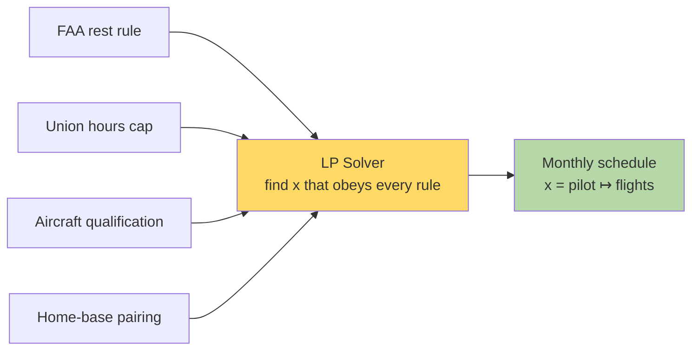
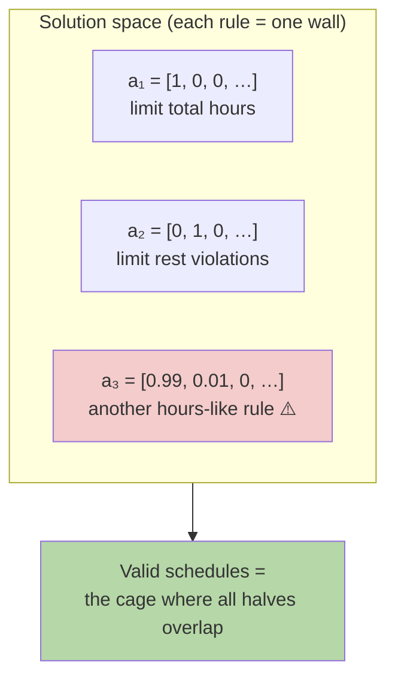
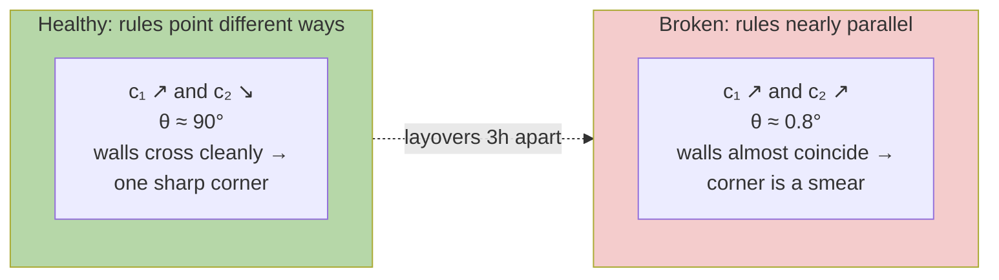
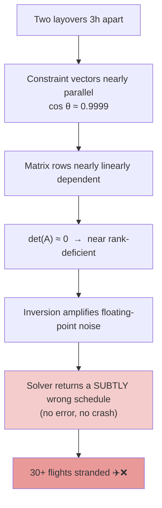
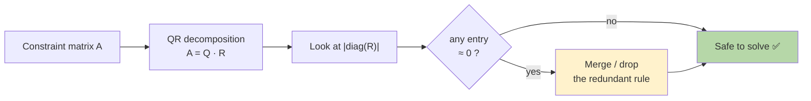
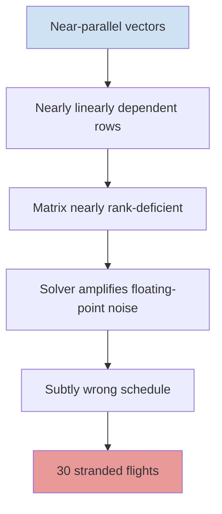
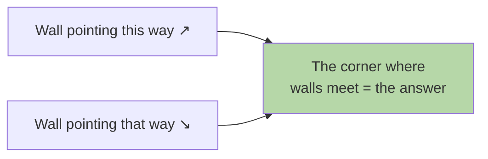
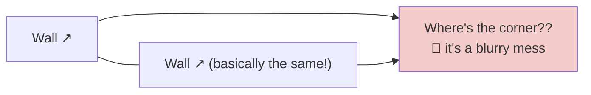
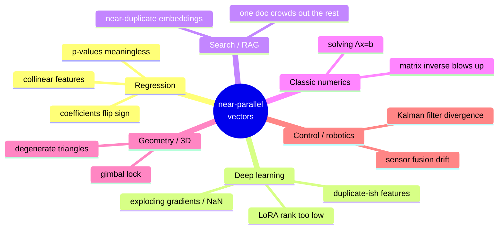

# American Airlines — Why Two Look-Alike Layovers Crashed the Solver

> A deep-dive on the second real-world story from [real-world-stories.md](real-world-stories.md).
> **One sentence:** when two scheduling rules point in *almost the same direction*, the math that solves the schedule blows up — and the fix is to *see* the geometry before the solver ever runs.

---

## 1. The Business Problem

Every month American Airlines must place **~15,000 pilots** onto **~6,700 flights a day**. A schedule isn't free-form — it's boxed in by hard rules:

| Rule type | Example | Who sets it |
|---|---|---|
| Rest | ≥ 10 hours between duties | FAA (law) |
| Hours cap | ≤ 100 flight hours / month | Union contract |
| Qualification | Must be type-rated for the aircraft | Training |
| Pairing | Start and end at home base | Operations |

Find **one** assignment that satisfies **all** of them at once. That's a classic **Linear Program (LP)**.



---

## 2. The Key Reframe: a Rule *Is* a Vector

This is the whole story in one idea. **Each rule is a row in a matrix**, and each row is a **vector that points in the direction the rule pushes.**

$$
A\,\vec{x} \le \vec{b}
\qquad
A = \begin{bmatrix} \rule[.5ex]{2.5em}{0.4pt}\ \vec{a_1}\ \rule[.5ex]{2.5em}{0.4pt} \\ \rule[.5ex]{2.5em}{0.4pt}\ \vec{a_2}\ \rule[.5ex]{2.5em}{0.4pt} \\ \vdots \\ \rule[.5ex]{2.5em}{0.4pt}\ \vec{a_m}\ \rule[.5ex]{2.5em}{0.4pt} \end{bmatrix}
$$

Each constraint vector $\vec{a_i}$ **slices space into two halves** and says "your schedule must live on *this* side."



The valid schedules are the **intersection of all the half-spaces** — a polytope (a many-sided "cage"). The solver walks the corners of that cage looking for the best one.

---

## 3. Where It Goes Wrong: Two Near-Identical Layovers

Now picture two layovers only a few hours apart:

- **Layover A** — departs LAX 08:00, arrives DFW 13:00
- **Layover B** — departs LAX 08:00, arrives DFW 16:00

To the airline these are different flights. To the *math* their constraint vectors are nearly the same arrow:

$$
\vec{c_1} = [\,1,\ 0.97,\ 0.02,\ \ldots\,]
\qquad
\vec{c_2} = [\,1,\ 0.99,\ 0.01,\ \ldots\,]
$$

How "the same"? Measure the angle with cosine similarity:

$$
\cos\theta = \frac{\vec{c_1}\cdot\vec{c_2}}{\lVert\vec{c_1}\rVert\,\lVert\vec{c_2}\rVert} \approx 0.9999
\quad\Longrightarrow\quad \theta \approx 0.8^\circ
$$

Less than one degree apart. Geometrically they're almost the **same wall built twice**.



### Why a smeared corner is fatal

The solver finds a schedule by computing **where walls intersect** (a corner of the cage). To do that it inverts a small matrix built from those constraint rows. When two rows are nearly parallel:

$$
\det(A) \approx 0 \quad\Longrightarrow\quad A^{-1} \text{ has huge entries} \quad\Longrightarrow\quad \text{tiny errors get amplified by millions}
$$

This is **ill-conditioning**. The matrix is *technically* invertible, so the solver doesn't crash — it confidently returns a corner that's off by a hair, which becomes a wrong pilot pairing.



> **The dangerous part:** there is no exception, no red text. The solver succeeds and lies. At 6,700 flights/day, even **0.01%** bad pairings strand **30+ flights**.

---

## 4. Build the Intuition with a Tiny Example

You don't need 15,000 pilots to feel this. Two equations, two unknowns:

**Well-conditioned** (lines cross at a clear angle):

$$
\begin{cases} x + y = 2 \\ x - y = 0 \end{cases}
\quad\Rightarrow\quad (x,y) = (1,1)\ \text{— stable}
$$

**Ill-conditioned** (lines almost on top of each other):

$$
\begin{cases} x + y = 2 \\ x + 1.0001\,y = 2.0001 \end{cases}
\quad\Rightarrow\quad \text{nudge a digit and the answer leaps}
$$

```python
import numpy as np

# Two nearly-parallel constraints
A = np.array([[1.0, 1.0],
              [1.0, 1.0001]])
b = np.array([2.0, 2.0001])

print("condition number:", np.linalg.cond(A))   # ~40,000 — alarmingly high
print("solution:", np.linalg.solve(A, b))        # [1, 1]

# Perturb b by one ten-thousandth — a rounding-error-sized change
b2 = np.array([2.0, 2.0002])
print("perturbed:", np.linalg.solve(A, b2))      # [0, 2] — the answer MOVED A LOT
```

A change in the 4th decimal of the input moved the answer from `[1, 1]` to `[0, 2]`. **That** is what a fleet scheduler feels as "the solver went wobbly."

---

## 5. The Fix: a QR Pre-Check (See It Before You Solve It)

The engineer who reads *"near-parallel constraint vectors"* instead of *"weird solver bug"* knows the cure is to **detect the duplicate rows before solving**, using **QR decomposition** (which is just Gram-Schmidt under the hood).

QR factors the constraint matrix as:

$$
A = Q\,R
$$

where $Q$ has orthonormal columns and $R$ is upper-triangular. The magic is in the **diagonal of $R$**: each diagonal entry measures how much *new, independent* direction a constraint adds. A near-zero entry = "this rule is a near-duplicate of an earlier one."



```python
import numpy as np

Q, R = np.linalg.qr(A)
diagonal = np.abs(np.diag(R))

# Near-zero diagonal entry = nearly linearly dependent constraint
redundant = np.where(diagonal < 1e-6)[0]
print(f"Redundant constraints: {redundant}")   # drop or merge these BEFORE solving
```

A ~10-line pre-check, run once, fixes the **entire class** of failures — not one flight.

---

## 6. The Core Insight



Two engineers, same bug report:

| Sees… | Does… | Result |
|---|---|---|
| "weird solver instability" | adds heuristics, retries, special cases | weeks of work, bug returns next quarter |
| "near-parallel constraint vectors" | runs `np.linalg.qr(A)`, drops duplicates | ~10 lines, whole bug class gone |

> **The geometry makes the bug obvious. Without it, the bug is invisible.**

---

## 7. Explain It Like I'm 5

Imagine you're building a fort, and the walls of the fort are the **rules** about where pilots can go. Where all the walls meet is the **one spot** that follows every rule — that's your finished schedule.



Now here's the problem. Two flights were **almost exactly the same** (same takeoff, landing just 3 hours apart). So the computer built **two walls that lay almost on top of each other** — like trying to find a corner between two pieces of paper stacked flat.



When two walls are basically the same, **there is no clear corner** — just a fuzzy smear. The computer still picks a spot, but it picks the *wrong* spot, and it doesn't tell anybody. That wrong spot = a pilot sent to the wrong flight = **30 planes stuck on the ground.**

**The fix in one breath:** Before solving, the smart engineer runs a quick check (`np.linalg.qr`) that asks *"are any two walls basically the same wall?"* If yes, throw one away. Now every corner is sharp again, and the schedule comes out right.

| In kid words | In math words |
|---|---|
| Two flights almost the same | Two vectors nearly parallel |
| Two walls stacked flat | Rows nearly linearly dependent |
| No clear corner | Matrix is "ill-conditioned" (det ≈ 0) |
| Computer guesses wrong, quietly | Tiny errors blow up huge |
| Check for copycat walls first | QR pre-check before solving |

**The whole lesson:** if two things point the same way, treating them as separate makes the math fall apart. Spot the copies *first*.

---

## 8. Prove It Yourself — Runnable Code on Real Data

Everything above is just words until you watch the numbers misbehave. Two scripts in [`../examples/`](../examples/) do exactly that. Both are **copy-paste runnable** (`pip install numpy pandas requests scikit-learn`). The output blocks below are the **actual captured output** from running them.

### Example 1 — The airline solver in miniature ([airline_solver_demo.py](../examples/airline_solver_demo.py))

Two constraints. In Case A they point different ways; in Case B they're near-duplicates (differ only in the 4th decimal). We solve `A x = b`, then nudge `b` by `0.0001` and watch the answer.

```python
import numpy as np

def report(name, A, b):
    c1, c2 = A[0], A[1]
    cos = (c1 @ c2) / (np.linalg.norm(c1) * np.linalg.norm(c2))
    ang = np.degrees(np.arccos(np.clip(cos, -1, 1)))
    print(f"angle between rows : {ang:.3f} deg")
    print(f"det(A)             : {np.linalg.det(A):.6e}")
    print(f"cond(A)            : {np.linalg.cond(A):,.1f}")
    x  = np.linalg.solve(A, b)
    x2 = np.linalg.solve(A, b + np.array([0.0, 1e-4]))   # nudge b by 0.0001
    print(f"x                  : {x}")
    print(f"x after tiny nudge : {x2}")
    print(f"answer moved by    : {np.linalg.norm(x2 - x):.4f}")

# Case A: sensible flights — rows perpendicular
report("good", np.array([[1.,0.],[0.,1.]]),       np.array([2., 2.]))
# Case B: look-alike layovers — rows nearly parallel
report("bad",  np.array([[1.,1.],[1.,1.0001]]),   np.array([2., 2.0001]))
```

**Real output:**

```text
--- well-conditioned ---
angle between rows : 90.000 deg
det(A)             : 1.000000e+00
cond(A)            : 1.0
x                  : [2. 2.]
x after tiny nudge : [2.     2.0001]
answer moved by    : 0.0001          <- nudge in, same-size nudge out. Stable.

--- ill-conditioned ---
angle between rows : 0.003 deg        <- the two layovers, basically one wall
det(A)             : 1.000000e-04     <- determinant collapsing toward 0
cond(A)            : 40,002.0         <- amplification factor ~40,000x
x                  : [1. 1.]
x after tiny nudge : [-0. 2.]
answer moved by    : 1.4142           <- 0.0001 in, 1.4 out. 14,000x blowup!
```

And the QR pre-check that flags Case B *before* solving:

```python
for name, A in [("CASE A", A_good), ("CASE B", A_bad)]:
    Q, R = np.linalg.qr(A)
    smallest = np.abs(np.diag(R)).min()
    print(name, "min|diag(R)| =", round(smallest, 6),
          "->", "DUPLICATE ROW!" if smallest < 1e-3 else "ok")
```

```text
CASE A: min |diag(R)| = 1.000000  ->  ok
CASE B: min |diag(R)| = 0.000071  ->  DUPLICATE ROW -- drop/merge!
```

> **Read it:** `angle → 0°`, `det → 0`, `cond → huge` are **three names for the same danger**. A 0.0001 input error became a 1.4 output error — a **14,000× blowup**. That is exactly what "the solver went wobbly" feels like.

---

### Example 2 — The same bug in a real regression ([near_parallel_demo.py](../examples/near_parallel_demo.py))

We pull the **Longley dataset** (US economy, 1947–1962) live from the internet. It's the textbook multicollinearity case: `GNP`, `Population`, and `Year` all march upward together, so their column vectors nearly point the same way.

```python
import pandas as pd, requests, numpy as np
from io import StringIO

URL = "https://vincentarelbundock.github.io/Rdatasets/csv/datasets/longley.csv"
df = pd.read_csv(StringIO(requests.get(URL, timeout=30).text)).drop(columns=["rownames"])

FEATURES = ["GNP.deflator","GNP","Unemployed","Armed.Forces","Population","Year"]
X = df[FEATURES].to_numpy(float)
Xc = X - X.mean(0)                       # center to compare SHAPE not sign

def cosine(a, b): return (a@b)/(np.linalg.norm(a)*np.linalg.norm(b))
print("GNP vs Year   cos =", round(cosine(Xc[:,1], Xc[:,5]), 4))
print("cond(X)       =", f"{np.linalg.cond(np.column_stack([np.ones(len(X)), X])):,.0f}")
```

**Real output — the feature vectors really are near-parallel:**

```text
pair                          cos(theta)  angle(deg)
GNP.deflator vs GNP               0.9916        7.44  <-- NEARLY PARALLEL
GNP.deflator vs Year              0.9911        7.63  <-- NEARLY PARALLEL
GNP vs Population                 0.9911        7.65  <-- NEARLY PARALLEL
GNP vs Year                       0.9953        5.57  <-- NEARLY PARALLEL
Population vs Year                0.9940        6.30  <-- NEARLY PARALLEL

cond(X) = 23,845,862     ~ you lose about 7 of your ~16 decimal digits
```

The **QR pre-check** points straight at the culprits (`Year`, `Population` add almost no new direction):

```text
Year            |R_ii| =       0.6693  <-- redundant direction
Population      |R_ii| =       1.4632  <-- redundant direction
GNP             |R_ii| =      49.8229
Unemployed      |R_ii| =     282.0602
```

The **payoff** — fit the model, nudge the data by 0.1%, refit (features standardized so coefficients are comparable):

```text
                BEFORE fix (all 6 features)        AFTER fix (3 kept)
cond (standardized)   111                          3.7
0.1% data nudge ->    coefficients move 1%         coefficients move 0.1%
                      (~10x amplification)         (no amplification)
```

> **Read it:** the condition number *is* the amplification factor. At `cond ≈ 111`, a 0.1% wobble in the data becomes a ~1% wobble in what the model claims. Drop the near-parallel columns and `cond` falls to `3.7` — the model becomes trustworthy. Same data, same algorithm; the only change is *removing the duplicate directions you can now see.*

---

## 9. Where This Bites You If You DON'T Get It

The airline solver is one face of a single idea: **near-parallel vectors make math unstable.** That idea shows up everywhere, usually disguised as a different "random" bug.



| Domain | What you do without the concept | What actually breaks | The tell |
|---|---|---|---|
| **Linear/logistic regression** | Feed in `price_usd` *and* `price_eur` | Coefficients become huge, flip sign between runs, p-values are nonsense | `cond(X)` huge; VIF > 10 |
| **Feature engineering** | Add 5 "different" features that are all proxies for company size | Model looks fine on train, generalizes badly; you can't tell which feature matters | high pairwise `cos` between feature columns |
| **Neural net training** | Weight rows drift toward each other (rank collapse) | Loss suddenly spikes to **NaN**, gradients explode, runs aren't reproducible across GPUs | gradient norm spikes; tiny singular values |
| **LoRA fine-tuning** | Pick `rank` too low for near-duplicate update directions | Adapter can't learn; or too high and it overfits/forgets | rank vs. effective rank mismatch |
| **RAG / semantic search** | Index near-duplicate document chunks | One near-duplicate floods the top-k; genuinely relevant docs get pushed out | embeddings with `cos > 0.99` |
| **Solving `Ax = b`** | Trust `np.linalg.inv(A) @ b` blindly | Answer is confidently wrong by orders of magnitude | `det(A) ≈ 0`, `cond(A)` huge |
| **3D graphics / robotics** | Use Euler angles near a pole | **Gimbal lock** — two rotation axes align, you lose a degree of freedom | two axis vectors parallel |
| **Sensor fusion / Kalman** | Two sensors measuring nearly the same thing | Covariance matrix near-singular, filter diverges | near-parallel measurement rows |
| **Optimization / LP** | Two near-identical constraints (the airline!) | Solver returns a subtly wrong vertex; no error raised | near-parallel constraint rows |

### The three-line health check you can paste anywhere

Whenever you build a matrix from "features," "constraints," or "measurements," run this **before** you trust whatever comes next:

```python
import numpy as np

def health_check(A, name="matrix"):
    A = np.asarray(A, float)
    cond = np.linalg.cond(A)
    rdiag = np.abs(np.diag(np.linalg.qr(A)[1])) if A.shape[0] >= A.shape[1] else None
    print(f"[{name}] cond = {cond:,.0f}", "OK" if cond < 1e3
          else "SHAKY" if cond < 1e6 else "DANGEROUS")
    if rdiag is not None and rdiag.min() < 1e-6 * rdiag.max():
        print(f"  -> column {rdiag.argmin()} is a near-duplicate direction; drop/merge it")
```

> If `cond < 1e3` you're fine. `1e3–1e6`: be suspicious. `> 1e6`: something is a near-duplicate — find it with QR and remove it. **This one habit prevents an entire category of "mystery" bugs.**

---

## Remember This

- A **constraint is a vector**; a system of rules is a **matrix of arrows**.
- **Near-parallel rows** ⇒ **small determinant** ⇒ **ill-conditioned** ⇒ amplified rounding error.
- The solver won't crash — it will return a *confidently wrong* answer. That's worse.
- **`np.linalg.cond(A)`** tells you *how bad*; **`np.linalg.qr(A)`** tells you *which rows* to blame.
- When a numeric routine "goes wobbly," ask first: *what does this look like geometrically?*
