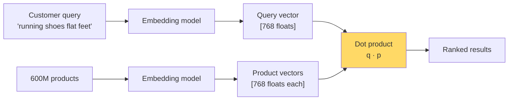

# Linear Algebra Intuition — Real-World Stories

> When you can *see* vectors as arrows in space, you fix bugs in 20 minutes that others paper over for years.

## The Big Idea

Every ML model lives in vector space. It "understands" something by placing similar things close together and different things far apart. Linear algebra is just the language for talking about that geometry.



## Code: Why Adding a Modifier Can Wash Out the Signal

```python
import numpy as np

def cosine(a, b):
    return (a @ b) / (np.linalg.norm(a) * np.linalg.norm(b))

# Toy embedding space: dim 0 = "shoe-ness", dim 1 = "flat-feet specificity"
shoes              = np.array([1.0, 0.0])
running_shoes      = np.array([0.95, 0.1])
flat_feet_shoes    = np.array([0.6, 0.8])      # modifier rotates the vector
flat_feet_modifier = np.array([0.0, 1.0])      # near-perpendicular to base

query = (running_shoes + flat_feet_modifier)
query /= np.linalg.norm(query)

for name, v in [("shoes", shoes), ("running", running_shoes), ("flat-feet", flat_feet_shoes)]:
    print(f"{name:12s}: cos = {cosine(query, v):.3f}")
```

The lesson: if the modifier points in a perpendicular direction, naive addition dilutes the main word. Fix it with concatenation or cross-attention — not a regex.

## Story 1: Amazon — Why "Shoes for Flat Feet" Showed Generic Shoes

A customer searches `"running shoes for flat feet"`. Search turns that into a 768-number vector and dot-products it against 600 million product vectors. Sounds clean.

But the words `"for flat feet"` push the query into a direction the product vectors barely look at. So the dot product mostly measures `"running shoes"` and the customer sees… running shoes. They bounce.

The engineer who pictures this geometrically says: "the modifier is orthogonal — let's add a cross-attention re-ranker." The engineer who doesn't writes a `if "flat feet" in query` regex and patches one search. The first solution fixes a class of bugs. The second one ships ten more next quarter.

## Story 2: American Airlines — Why Two Look-Alike Layovers Crashed the Solver

Each flight leg is a constraint. Each pilot's monthly schedule is a point inside a giant cage of rules (FAA rest, union contracts). Standard linear programming.

The problem: when two constraint vectors are nearly parallel — say, two near-identical layovers a few hours apart — the solver sees them as duplicates and goes wobbly. At 6,700 flights a day, even 0.01% bad pairings strand 30+ flights.

The engineer who reads "near-parallel constraint vectors" instead of "weird solver bug" knows to do a QR pre-check to spot duplicates *before* the solver runs.

## Remember This

- Vectors are directions, not lists of numbers.
- Dot product measures alignment; perpendicular means independent.
- When something breaks, ask "what does this look like geometrically?" first.
