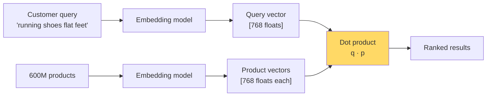

# Linear Algebra Intuition — Real-World Stories

> Why vector geometry is the difference between fixing a search bug in 20 minutes vs. shipping a workaround that lasts 6 quarters.

## The Mental Model

Every ML model lives in vector space. A model "understands" something when it places similar things near each other and dissimilar things far apart. Linear algebra is the language of that geometry.



## Code: Why Cosine Similarity Loses Signal on Modifiers

```python
import numpy as np

def cosine(a, b):
    return (a @ b) / (np.linalg.norm(a) * np.linalg.norm(b))

# Toy embedding space: dim 0 = "shoe-ness", dim 1 = "flat-feet specificity"
shoes              = np.array([1.0, 0.0])
running_shoes      = np.array([0.95, 0.1])
flat_feet_shoes    = np.array([0.6, 0.8])      # modifier rotates the vector
flat_feet_modifier = np.array([0.0, 1.0])      # near-orthogonal to base

query = (running_shoes + flat_feet_modifier)   # naive combine
query /= np.linalg.norm(query)

for name, v in [("shoes", shoes), ("running", running_shoes), ("flat-feet", flat_feet_shoes)]:
    print(f"{name:12s}: cos = {cosine(query, v):.3f}")
```

The lesson: when a modifier vector is near-orthogonal to the base, naive vector addition dilutes the base signal. The fix is concatenation or cross-attention — not a regex.

## Amazon — Product Search Ranking

A query like `"running shoes for flat feet"` becomes a 768-dim vector. Ranking is the dot product of that query with each of ~600M product vectors. When the modifier `"for flat feet"` lives in a near-orthogonal direction to `"running shoes"`, the dot product collapses to nearly the base signal — search shows generic running shoes and the customer bounces.

An engineer who *sees* this geometrically proposes a cross-attention re-ranker that scores the modifier against product attributes directly. An engineer without that intuition writes a regex for "flat feet" and patches the symptom for one query.

## American Airlines — Crew Pairing Feasibility

Each flight leg is a constraint vector (departure airport, arrival, time, equipment). Each pilot's monthly schedule is a point in a high-dimensional feasibility polytope defined by FAA rest rules and union contracts.

When two constraint vectors become nearly parallel (e.g., two near-identical layovers a few hours apart), the LP solver hits numerical degeneracy and may emit an infeasible pairing. At AA's volume of ~6,700 daily flights, even 0.01% bad pairings strand 30+ flights/day.

The engineer who sees "near-parallel constraint vectors" instead of "weird solver bug" knows to preprocess with column-pivoted QR to detect the degeneracy *before* the LP runs.

## Takeaways

- Vectors are not lists of numbers — they are *directions and magnitudes*.
- Dot products measure alignment; orthogonality means independence.
- When models fail, ask "what does this look like geometrically?" before patching code.
