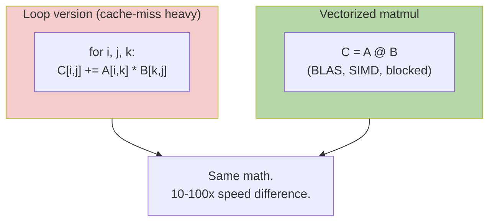

# Vectors & Matrices Operations — Real-World Stories

> Microseconds matter when your matmul runs a billion times a day.

## The Mental Model

`A @ B` is not just multiplication — it's a *memory access pattern*. The same math, written two different ways, can be 10x faster or slower depending on cache lines and SIMD.



## Code: The Same Operation, Two Costs

```python
import numpy as np, time

A = np.random.randn(1024, 1024).astype(np.float32)
B = np.random.randn(1024, 1024).astype(np.float32)

# Naive triple loop
def slow_matmul(A, B):
    n, m = A.shape[0], B.shape[1]
    C = np.zeros((n, m), dtype=np.float32)
    for i in range(n):
        for j in range(m):
            for k in range(A.shape[1]):
                C[i, j] += A[i, k] * B[k, j]
    return C

# Vectorized
t0 = time.time(); C1 = A @ B; t1 = time.time()
print(f"vectorized: {(t1-t0)*1000:.2f} ms")

# (Don't actually run slow_matmul on 1024x1024 — it would take minutes.)
# Use 64x64 to see the gap:
A_small, B_small = A[:64,:64], B[:64,:64]
t0 = time.time(); slow_matmul(A_small, B_small); t1 = time.time()
print(f"loop 64x64: {(t1-t0)*1000:.2f} ms")
t0 = time.time(); A_small @ B_small; t1 = time.time()
print(f"vec  64x64: {(t1-t0)*1000:.2f} ms")
```

## Code: Broadcasting Replaces Loops

```python
# Compute pairwise distances between N queries and M products
queries  = np.random.randn(1000, 128)   # (N, D)
products = np.random.randn(50000, 128)  # (M, D)

# Wrong: explicit loop — slow
# for q in queries:
#     for p in products: ...

# Right: broadcasting
diffs = queries[:, None, :] - products[None, :, :]  # (N, M, D)
dists = np.linalg.norm(diffs, axis=2)               # (N, M)

# Even better: use the algebraic identity ||a-b||^2 = ||a||^2 + ||b||^2 - 2 a·b
q2 = (queries ** 2).sum(1)[:, None]
p2 = (products ** 2).sum(1)[None, :]
dists_sq = q2 + p2 - 2 * queries @ products.T
```

## Amazon — Alexa Wake Word

The wake-word detector runs as a tiny matmul (~50K params) continuously on every Echo. Rewriting `A @ B` as `(B.T @ A.T).T` to fit L2 cache cut latency 15% — at Echo scale, that's tangible battery life saved across tens of millions of devices.

The engineer who proposed that transformation didn't read it in a paper. They could read matmul as a memory-access pattern, not just multiplication.

## American Airlines — Real-Time Re-Planning

Each flight has a payload vector `[passengers, cargo, fuel]` and a constraint matrix `[CG limits, runway length, weather margin]`. Dispatch multiplies these thousands of times per minute across ~6,700 daily flights.

Looping per-flight would take 4 hours batch time. Vectorizing — one giant batched matmul across all flights — lets ops re-plan in seconds when a storm grounds DFW. Engineers who didn't think in vectorized ops couldn't have built that system.

## Takeaways

- Same math, different access patterns = orders of magnitude difference.
- Broadcasting is not syntax sugar — it is the algorithm.
- Algebraic identities (like `||a-b||^2`) often unlock the fast path.
