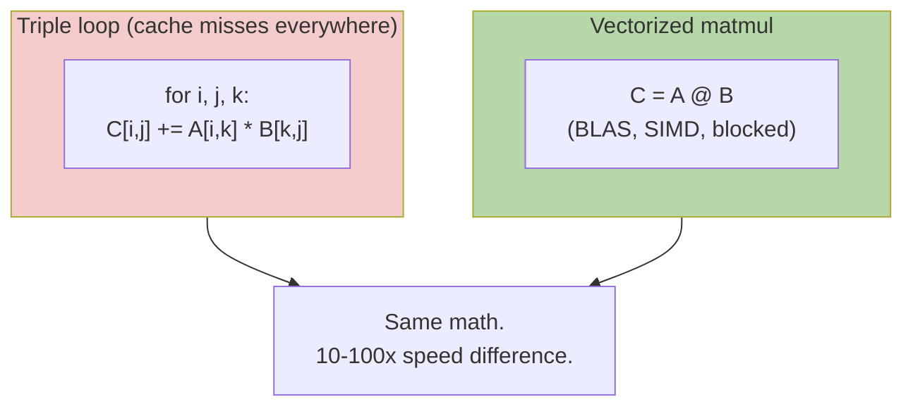

# Vectors & Matrices Operations — Real-World Stories

> The same math, written two different ways, can run 100x faster. Microseconds matter when your matmul runs a billion times a day.

## The Big Idea

`A @ B` isn't just multiplication. It's a *memory pattern*. If your CPU can keep the right chunks in cache and use SIMD, you fly. If it can't, the same answer takes 100x longer.



## Code: Same Operation, Two Costs

```python
import numpy as np, time

A = np.random.randn(1024, 1024).astype(np.float32)
B = np.random.randn(1024, 1024).astype(np.float32)

def slow_matmul(A, B):
    n, m = A.shape[0], B.shape[1]
    C = np.zeros((n, m), dtype=np.float32)
    for i in range(n):
        for j in range(m):
            for k in range(A.shape[1]):
                C[i, j] += A[i, k] * B[k, j]
    return C

t0 = time.time(); A @ B; t1 = time.time()
print(f"vectorized: {(t1-t0)*1000:.2f} ms")

# Try the loop on a smaller block to see the gap
A_small, B_small = A[:64,:64], B[:64,:64]
t0 = time.time(); slow_matmul(A_small, B_small); t1 = time.time()
print(f"loop 64x64: {(t1-t0)*1000:.2f} ms")
```

## Code: Broadcasting Beats Loops

```python
queries  = np.random.randn(1000, 128)
products = np.random.randn(50000, 128)

# Right: broadcasting
diffs = queries[:, None, :] - products[None, :, :]
dists = np.linalg.norm(diffs, axis=2)

# Even better: ||a-b||^2 = ||a||^2 + ||b||^2 - 2 a·b
q2 = (queries ** 2).sum(1)[:, None]
p2 = (products ** 2).sum(1)[None, :]
dists_sq = q2 + p2 - 2 * queries @ products.T
```

## Story 1: Amazon — How Rewriting One Matmul Saved Battery on Every Echo

The Alexa wake-word detector is a tiny matmul that runs nonstop on every Echo. Tens of millions of devices, always on.

An engineer noticed it was thrashing cache. They rewrote `A @ B` as `(B.T @ A.T).T` — same answer, but the chunks fit in L2 cache now. Latency dropped 15%. Across millions of devices that's real battery saved, real money on cloud passthrough.

They didn't read this trick in a paper. They could read a matmul as a memory pattern, not just arithmetic.

## Story 2: American Airlines — Re-Planning 6,700 Flights in Seconds, Not Hours

When a storm grounds DFW, dispatch has to re-plan thousands of flights fast. Each flight has a load vector (passengers, cargo, fuel) and a constraint matrix (weight limits, runway, weather).

The old code looped flight-by-flight: 4 hours. Too slow — by then the storm had moved.

The fix: stack everything into one giant batched matmul. Same arithmetic, one call. Result: seconds. The engineer who wrote it thought in vectorized ops from the start — no one ever would have built the system out of for-loops.

## Remember This

- Same math, different memory access = orders-of-magnitude speedup.
- Broadcasting is the algorithm, not syntax sugar.
- Algebraic identities (like `||a-b||² = ||a||² + ||b||² − 2a·b`) often unlock the fast path.
