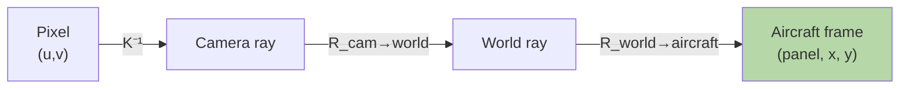

# Matrix Transformations — Real-World Stories

> Neural net layers are chained transformations. So are robot poses and drone cameras. Get one inverse wrong and you report a crack on the wrong aircraft panel.

## The Big Idea

A matrix is a function from one space to another. Chain a few and you can describe any geometry. The catch: order matters, and a single sign flip can mirror your world.



## Code: Building and Chaining Transforms

```python
import numpy as np

def rotation_2d(theta):
    c, s = np.cos(theta), np.sin(theta)
    return np.array([[c, -s], [s, c]])

def scaling(sx, sy):
    return np.array([[sx, 0], [0, sy]])

# Rotate then scale — order matters!
v = np.array([1.0, 0.0])
R = rotation_2d(np.pi/4)
S = scaling(2, 1)

print(S @ R @ v)   # [1.414..., 0.707...]
print(R @ S @ v)   # [1.414..., 1.414...]
```

## Code: 3D Pose Composition (Robot / Drone Pattern)

```python
def transform_4x4(R, t):
    T = np.eye(4)
    T[:3, :3] = R
    T[:3,  3] = t
    return T

T_cam_world = transform_4x4(np.eye(3), np.array([10.0, 5.0, 2.0]))
T_world_air = transform_4x4(np.eye(3), np.array([0.0, 0.0, -3.0]))

T_cam_air = T_world_air @ T_cam_world
point_cam = np.array([1.0, 0.5, 4.0, 1.0])
point_air = T_cam_air @ point_cam
```

## Story 1: Amazon — The Warehouse Robot That Saw Phantom Collisions

Each Kiva robot in an Amazon warehouse carries a shelf. The shelf's location is the robot's pose times an offset matrix. Simple.

One day the fleet manager started flagging "phantom collisions" — shelves crashing into things that weren't there. After hours of head-scratching, an engineer traced it: a missing inverse. The offset was being applied twice, placing the shelf 60 cm from where the robot actually was.

Diagnosing it took someone fluent in transform chains who could ask "what does each matrix represent, and which direction does it go?"

## Story 2: American Airlines — One Negative Sign That Sent Crews to the Wrong Panel

AA inspects aircraft tails with drones. Each photo passes through three transforms: camera intrinsics → drone pose → aircraft frame. That tells maintenance exactly where a crack is.

A sign error in the drone pose's z-axis meant every crack location got mirrored. Maintenance crews were sent to inspect undamaged panels. Real cracks went unflagged. Until someone read the chain end-to-end and asked "which transform is lying?"

The fix was one minus sign. The diagnosis required reading transforms like sentences.

## Remember This

- Matrix multiplication is *not* commutative. Order = operation order.
- Every "frame conversion" bug is a transform in the wrong order or direction.
- Sanity check: pick a known point, push it through the chain by hand, see if it lands where you expect.
