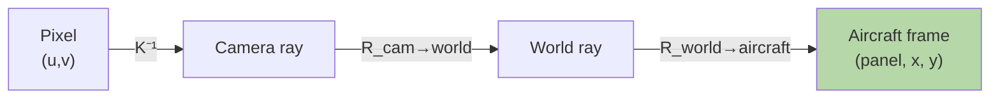

# Matrix Transformations — Real-World Stories

> Neural network layers are just chained transformations. So are robot poses, drone cameras, and aircraft frames.

## The Mental Model

A matrix is a function from one vector space to another. Chain them and you get arbitrary geometry. Get one inverse wrong and you report cracks on the wrong aircraft panel.



## Code: Building and Chaining Transforms

```python
import numpy as np

def rotation_2d(theta):
    c, s = np.cos(theta), np.sin(theta)
    return np.array([[c, -s], [s, c]])

def scaling(sx, sy):
    return np.array([[sx, 0], [0, sy]])

# Rotate then scale — order matters!
v = np.array([1.0, 0.0])
R = rotation_2d(np.pi/4)
S = scaling(2, 1)

rotate_then_scale = S @ R @ v
scale_then_rotate = R @ S @ v
print(rotate_then_scale)  # [1.414..., 0.707...]
print(scale_then_rotate)  # [1.414..., 1.414...]
```

## Code: 3D Pose Composition (Robot / Drone Pattern)

```python
def transform_4x4(R, t):
    T = np.eye(4)
    T[:3, :3] = R
    T[:3,  3] = t
    return T

# Camera-to-world transform
R_cw = rotation_2d(0)  # stub; use scipy.spatial.transform.Rotation in practice
T_cam_world  = transform_4x4(np.eye(3), np.array([10.0, 5.0, 2.0]))
T_world_air  = transform_4x4(np.eye(3), np.array([0.0, 0.0, -3.0]))

# Chain: a point in camera frame → aircraft frame
T_cam_air = T_world_air @ T_cam_world
point_cam = np.array([1.0, 0.5, 4.0, 1.0])
point_air = T_cam_air @ point_cam
```

## Amazon — Kiva Warehouse Robots

Each Kiva robot's pose is a 4x4 transformation matrix. When it picks up a shelf, the shelf's frame becomes `T_robot @ T_shelf_offset`. "Phantom collisions" reported by the fleet manager were traced to a missing inverse — the offset was applied twice, placing the shelf 60 cm from where the robot actually was. Diagnosing it required someone fluent in transform chains.

## American Airlines — Drone Tail Inspection

AA inspects aircraft tails with drones. Each drone image is projected through:
1. Camera intrinsics (K)
2. Drone pose (extrinsics)
3. Aircraft model frame

A sign error in step 2's z-axis meant reported crack locations were mirrored — maintenance crews were sent to inspect undamaged panels while real damage went unflagged. The fix was one negative sign. The diagnosis required reading the full chain and finding which transform was lying.

## Takeaways

- Matrix multiplication is *not* commutative. Order = operation order.
- Every "frame conversion" bug is a transform composed in the wrong order or direction.
- The right mental check: pick a known point, push it through the chain by hand, and see if it lands where you expect.
