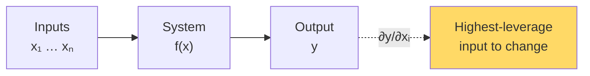

# Calculus for ML — Real-World Stories

> Gradients don't just train models. They tell ops centers where to push for the biggest result.

## The Big Idea

A gradient answers one question: "If I nudge this input a tiny bit, how much does the output change?" That's true for a loss function. It's also true for any system you can differentiate.



## Code: Gradients Reveal Leverage

```python
import numpy as np

# Toy delay model: total delay as a function of turn times at 3 hubs
def total_delay(turn_times, traffic):
    ord_delay = np.maximum(0, turn_times[0] - 45) * traffic[0]
    dfw_delay = np.maximum(0, turn_times[1] - 40) * traffic[1] + 0.5 * ord_delay
    clt_delay = np.maximum(0, turn_times[2] - 35) * traffic[2] + 0.3 * dfw_delay
    return ord_delay + dfw_delay + clt_delay

def grad(f, x, *args, eps=1e-4):
    g = np.zeros_like(x, dtype=float)
    for i in range(len(x)):
        xp = x.copy(); xp[i] += eps
        xm = x.copy(); xm[i] -= eps
        g[i] = (f(xp, *args) - f(xm, *args)) / (2 * eps)
    return g

turn = np.array([50.0, 45.0, 38.0])
traffic = np.array([1.0, 1.2, 0.8])
print("∂total/∂turn:", grad(total_delay, turn, traffic))
# The hub with the biggest gradient is the best place to push.
```

## Code: Per-Feature Gradient Clipping

```python
import torch, torch.nn as nn

model = nn.Linear(100, 1)
loss = (model(torch.randn(32, 100)).squeeze() - torch.randn(32)).pow(2).mean()
loss.backward()

for name, p in model.named_parameters():
    print(name, p.grad.abs().mean().item(), p.grad.abs().max().item())

torch.nn.utils.clip_grad_norm_(model.parameters(), max_norm=1.0)
```

## Story 1: Amazon — Why Best-Sellers Drowned Out the Items That Mattered on Prime Day

Demand forecasting trains on every SKU. The problem: best-sellers have so much data, they dominate the gradient. The "long tail" — the obscure items that occasionally surprise on Prime Day — barely move the loss at all.

So the model learns the popular stuff beautifully and stays clueless about the rest. Prime Day arrives, an unknown SKU spikes, the warehouse runs out, customer is angry.

The fix came from engineers who understood that gradient size mirrors data volume. They built grouped gradient clipping — every product class gets its fair say. Long-tail forecast accuracy jumped. Stockouts dropped.

## Story 2: American Airlines — Putting Out the *Right* Fire on a Delay Day

When ORD melts down, the obvious move is to throw resources at ORD. But the math says: the partial derivative of total system delay with respect to some smaller upstream hub may be *larger* — because that hub feeds ORD's connections.

In other words, fixing a small problem upstream might cool down ORD faster than fixing ORD itself. AA's ops dashboard ranks interventions by leverage, not by the size of the fire. That dashboard exists because someone modeled the network as a differentiable system.

## Remember This

- Gradients rank leverage anywhere outputs depend on inputs — not just in models.
- Gradient size mirrors data size; watch for the long tail being silently underweighted.
- "Where should I push?" is a calculus question.
