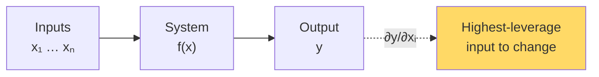

# Calculus for ML — Real-World Stories

> Gradients don't just train models — they tell operations centers *where to intervene*.

## The Mental Model

A gradient answers: "If I nudge this input by ε, how much does the output change?" That's true for loss functions *and* for any system you can differentiate through.



## Code: Gradients Show Leverage

```python
import numpy as np

# Toy "delay propagation" — total system delay as a function of turn times at 3 hubs
def total_delay(turn_times, traffic):
    # Each hub contributes nonlinearly; downstream hubs are sensitive to upstream
    ord_delay = np.maximum(0, turn_times[0] - 45) * traffic[0]
    dfw_delay = np.maximum(0, turn_times[1] - 40) * traffic[1] + 0.5 * ord_delay
    clt_delay = np.maximum(0, turn_times[2] - 35) * traffic[2] + 0.3 * dfw_delay
    return ord_delay + dfw_delay + clt_delay

# Numerical gradient
def grad(f, x, *args, eps=1e-4):
    g = np.zeros_like(x, dtype=float)
    for i in range(len(x)):
        xp = x.copy(); xp[i] += eps
        xm = x.copy(); xm[i] -= eps
        g[i] = (f(xp, *args) - f(xm, *args)) / (2 * eps)
    return g

turn = np.array([50.0, 45.0, 38.0])
traffic = np.array([1.0, 1.2, 0.8])
print("∂total/∂turn:", grad(total_delay, turn, traffic))
# The hub with the largest gradient is the highest-leverage intervention.
```

## Code: Per-Feature Gradient Clipping

```python
import torch, torch.nn as nn

model = nn.Linear(100, 1)
loss = (model(torch.randn(32, 100)).squeeze() - torch.randn(32)).pow(2).mean()
loss.backward()

# Inspect per-parameter gradient magnitudes — long-tail features have tiny ones
for name, p in model.named_parameters():
    print(name, p.grad.abs().mean().item(), p.grad.abs().max().item())

# Clip per feature group rather than globally so rare features keep their signal
torch.nn.utils.clip_grad_norm_(model.parameters(), max_norm=1.0)
```

## Amazon — Prime Day Demand Forecasting

Best-seller SKUs dominate the gradient because they have massive data volume. The long tail — the SKUs that *actually surprise* on Prime Day — get drowned out. Engineers who understood that gradient magnitudes mirror data influence built *grouped* gradient clipping that preserves long-tail signal. The forecast accuracy on rare items jumped, and Prime Day stockouts dropped.

## American Airlines — Where to Intervene on Delay Day

When ORD melts down, naive dispatching chases the biggest *current* delay. But `∂(total_system_delay) / ∂(ORD_turn_time)` may be smaller than the partial w.r.t. a smaller upstream hub feeding ORD's connections. AA's operations dashboards highlight high-leverage interventions, not loudest fires. The engineer who built that view thought of the network as a differentiable system.

## Takeaways

- Gradients are universal: anywhere outputs depend on inputs, gradients rank leverage.
- Magnitudes mirror data volume — guard against the long tail being silently underweighted.
- "Where should I push?" is a calculus question, not a heuristics question.
