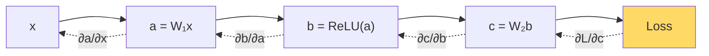

# Chain Rule & Autodiff — Real-World Stories

> A `.detach()` in the wrong place silently severs learning. Only someone who reads computation graphs catches it.

## The Mental Model

Backpropagation is the chain rule executed in reverse over a graph of operations. PyTorch/JAX automate it — but you must still know what the graph looks like to debug it.



## Code: Chain Rule by Hand vs Autograd

```python
import torch

x = torch.tensor(2.0, requires_grad=True)
y = torch.sin(x ** 2)            # y = sin(x²)
y.backward()
print("autograd:", x.grad.item())  # cos(x²) · 2x

# By hand
import math
manual = math.cos(2.0 ** 2) * 2 * 2.0
print("manual:  ", manual)
```

## Code: The Detach Bug

```python
import torch

# RL-style "simulator" — accidentally severs gradients
def simulator_buggy(action):
    state = action.detach() * 2.0   # BUG: detach kills gradient flow
    return state.sum()

def simulator_correct(action):
    state = action * 2.0
    return state.sum()

action = torch.tensor([1.0, 2.0, 3.0], requires_grad=True)
loss = simulator_buggy(action); loss.backward()
print("buggy grad:  ", action.grad)  # None or zeros — policy can't learn

action.grad = None
loss = simulator_correct(action); loss.backward()
print("correct grad:", action.grad)  # [2, 2, 2]
```

## Code: Verifying a Custom Backward

```python
import torch
from torch.autograd import gradcheck

class MySim(torch.autograd.Function):
    @staticmethod
    def forward(ctx, x):
        ctx.save_for_backward(x)
        return x.cos()
    @staticmethod
    def backward(ctx, grad_out):
        (x,) = ctx.saved_tensors
        return grad_out * (-x.sin())

x = torch.randn(5, dtype=torch.double, requires_grad=True)
assert gradcheck(MySim.apply, (x,), eps=1e-6)  # raises if your derivative is wrong
```

## Amazon — Custom Rekognition Similarity Layer

A face-matching pipeline needed a custom similarity op that autograd couldn't differentiate efficiently. The engineer derived the Jacobian-vector product, implemented `backward()`, and verified with `gradcheck` against a numerical gradient. Without that ability, the team would have either accepted slow autograd, or worse, shipped a wrong gradient that trained the model into a subtly broken state.

## American Airlines — RL for Gate Assignment

AA piloted RL for gate assignment at DFW. The reward chained: arrival → taxi → walk distance → connection probability. When the policy started picking weird gates, the bug was a `.detach()` inside the simulator that severed reward gradients. The fix required someone who could read the autograd graph node-by-node.

## Takeaways

- Autograd is mechanical chain rule — magic only if you understand what it's doing.
- `.detach()`, `.no_grad()`, and in-place ops are the three usual suspects when "model isn't learning."
- Every custom op needs a `gradcheck`. Trust math, not intuition.
