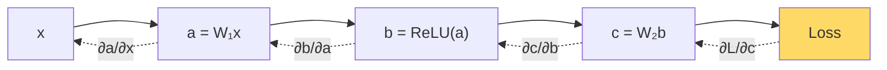

# Chain Rule & Autodiff — Real-World Stories

> A `.detach()` in the wrong place silently breaks learning. Only someone who reads the computation graph catches it.

## The Big Idea

Backpropagation is the chain rule, run backwards through a graph of operations. PyTorch and JAX do it for you — but to debug it, you still need to picture the graph.



## Code: Chain Rule by Hand vs Autograd

```python
import torch, math

x = torch.tensor(2.0, requires_grad=True)
y = torch.sin(x ** 2)
y.backward()
print("autograd:", x.grad.item())              # cos(x²) · 2x

manual = math.cos(2.0 ** 2) * 2 * 2.0
print("manual:  ", manual)
```

## Code: The Detach Bug

```python
import torch

def simulator_buggy(action):
    state = action.detach() * 2.0   # BUG: detach kills gradient flow
    return state.sum()

def simulator_correct(action):
    state = action * 2.0
    return state.sum()

action = torch.tensor([1.0, 2.0, 3.0], requires_grad=True)
loss = simulator_buggy(action); loss.backward()
print("buggy grad:  ", action.grad)            # None — policy can't learn

action.grad = None
loss = simulator_correct(action); loss.backward()
print("correct grad:", action.grad)            # [2, 2, 2]
```

## Code: Verifying a Custom Backward

```python
import torch
from torch.autograd import gradcheck

class MySim(torch.autograd.Function):
    @staticmethod
    def forward(ctx, x):
        ctx.save_for_backward(x)
        return x.cos()
    @staticmethod
    def backward(ctx, grad_out):
        (x,) = ctx.saved_tensors
        return grad_out * (-x.sin())

x = torch.randn(5, dtype=torch.double, requires_grad=True)
assert gradcheck(MySim.apply, (x,), eps=1e-6)
```

## Story 1: Amazon — The Custom Similarity Layer That Needed Its Own Gradient

A face-matching pipeline at Amazon needed a custom similarity step that autograd couldn't differentiate well. An engineer derived the gradient by hand, wrote `backward()`, and ran `gradcheck` to compare it to a numerical estimate.

Skipping that check would have given two equally bad options: live with slow autograd, or ship a wrong gradient that quietly trained the model into a broken state. Either way, you'd never know from the loss curve alone.

## Story 2: American Airlines — The RL Agent That Picked Weird Gates Because of One Detach

AA piloted reinforcement learning for gate assignment at DFW. The reward chained: arrival → taxi → walk distance → connection probability. Reasonable setup.

But the policy started picking nonsensical gates. The cause: a `.detach()` deep inside the simulator that quietly cut the reward gradient. The model received no learning signal for the actions that mattered.

Finding it required walking the autograd graph node by node and asking "where does the gradient stop?"

## Remember This

- Autograd is mechanical chain rule. It feels like magic only if you don't know what it's doing.
- `.detach()`, `torch.no_grad()`, and in-place ops are the three usual suspects when "the model isn't learning."
- Every custom op needs `gradcheck`. Trust math, not intuition.
