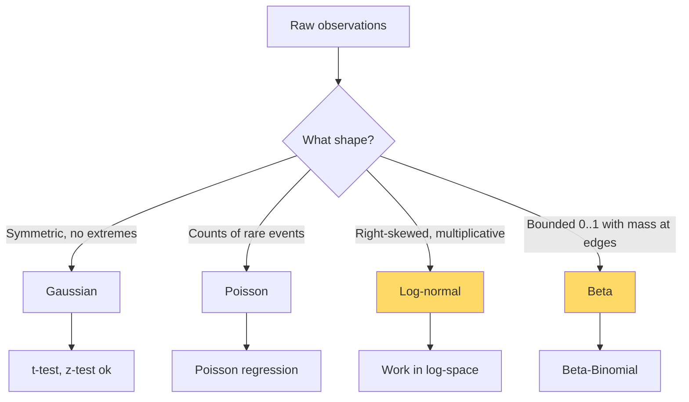

# Probability & Distributions — Real-World Stories

> Treating heavy-tailed data as Gaussian is the single most common mistake in production ML.

## The Big Idea

Distributions are not interchangeable. The shape of your uncertainty decides whether you're reading signal or noise. Pick the wrong shape and you'll celebrate wins that aren't real.



## Code: When Gaussian Lies to You

```python
import numpy as np
from scipy import stats

np.random.seed(0)
# Heavy-tailed revenue: most sessions $0-$50, rare $5000
control   = np.random.lognormal(mean=2.0, sigma=1.5, size=10_000)
treatment = np.random.lognormal(mean=2.05, sigma=1.5, size=10_000)

t, p = stats.ttest_ind(control, treatment)
print(f"t-test p = {p:.4f}  (often spuriously significant)")

t_log, p_log = stats.ttest_ind(np.log(control), np.log(treatment))
print(f"log t-test p = {p_log:.4f}")

u, p_u = stats.mannwhitneyu(control, treatment)
print(f"Mann-Whitney p = {p_u:.4f}")
```

## Code: Beta-Binomial vs Pooled Bernoulli

```python
import numpy as np

routes = ["DFW-LAX", "DFW-MIA", "JFK-LHR"]
trials = np.array([1000, 1000, 1000])
no_shows = np.array([80, 120, 30])

pooled = no_shows.sum() / trials.sum()
print(f"Pooled rate: {pooled:.3f}")

for r, n, k in zip(routes, trials, no_shows):
    a, b = 1 + k, 1 + (n - k)
    mean, lo, hi = a/(a+b), *np.percentile(np.random.beta(a, b, 50_000), [2.5, 97.5])
    print(f"{r}: mean={mean:.3f}  95% CI=[{lo:.3f}, {hi:.3f}]")
```

## Story 1: Amazon — How One $50,000 Order Made a Buy Box Experiment "Win"

The Buy Box team measures revenue per session. Revenue is heavy-tailed — most sessions are zero or small, occasionally a giant enterprise order. That's log-normal, not bell-shaped.

For years, analysts ran t-tests anyway. One whale order would tip a p-value below 0.05. Features got shipped on noise. Estimated cost: eight figures across the years before someone enforced the rule "log-transform first, or use a rank test, or bootstrap."

The math wasn't exotic. The team just needed enough probability literacy to recognize the wrong tool was being used.

## Story 2: American Airlines — Why One Global No-Show Rate Loses $50M a Year

Holiday Miami flights have a high no-show rate. London business routes have a low one. A single global average overbooks Miami too little (empty seats fly) and London too much (involuntary bumps).

The team switched to per-route Beta-Binomial with hierarchical pooling — each route gets its own estimate, but rare routes borrow strength from the average. Estimated $50M/year in better load factor, without measurably more bumped passengers.

## Remember This

- Pick the distribution that matches how the data was *generated*, not the default.
- Anywhere money is involved, suspect log-normal.
- For rates (CTR, no-show, conversion), Beta is your default — and credible intervals beat p-values for decisions.
