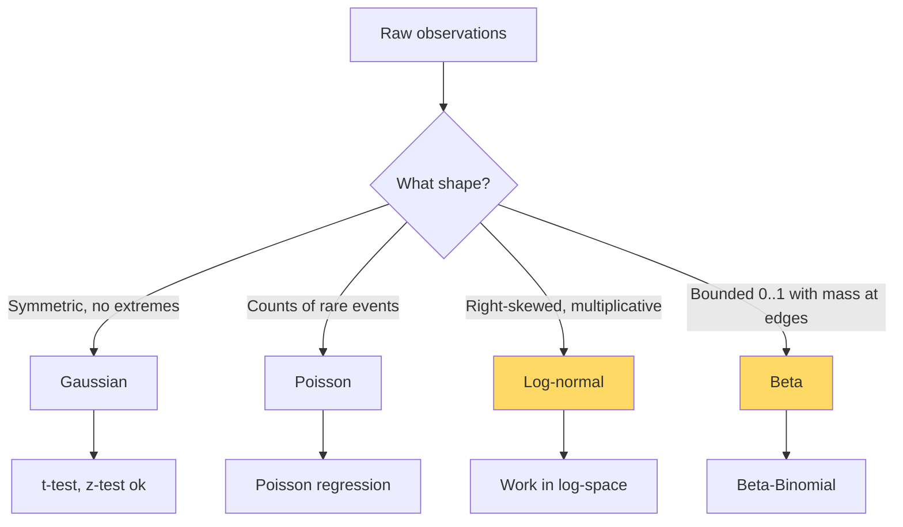

# Probability & Distributions — Real-World Stories

> The shape of your uncertainty determines whether your business decisions are based on signal or noise.

## The Mental Model

Distributions are *not* interchangeable. Treating heavy-tailed data as Gaussian is the single most common mistake in production ML.



## Code: When Gaussian Lies to You

```python
import numpy as np
from scipy import stats

np.random.seed(0)
# Heavy-tailed revenue (log-normal): most sessions $0-$50, occasional $5000
control   = np.random.lognormal(mean=2.0, sigma=1.5, size=10_000)
treatment = np.random.lognormal(mean=2.05, sigma=1.5, size=10_000)

# Naive t-test (assumes Gaussian)
t, p = stats.ttest_ind(control, treatment)
print(f"t-test p = {p:.4f}  (often spuriously significant)")

# Better: work in log-space where the distribution is symmetric
t_log, p_log = stats.ttest_ind(np.log(control), np.log(treatment))
print(f"log t-test p = {p_log:.4f}")

# Or: rank-based (no distribution assumption)
u, p_u = stats.mannwhitneyu(control, treatment)
print(f"Mann-Whitney p = {p_u:.4f}")
```

## Code: Beta-Binomial vs Pooled Bernoulli

```python
import numpy as np

# Per-route no-show rates differ — pooling hides the variation
routes = ["DFW-LAX", "DFW-MIA", "JFK-LHR"]
trials = np.array([1000, 1000, 1000])
no_shows = np.array([80, 120, 30])

# Pooled rate
pooled = no_shows.sum() / trials.sum()
print(f"Pooled rate: {pooled:.3f}")

# Per-route Beta posterior (uniform prior)
for r, n, k in zip(routes, trials, no_shows):
    a, b = 1 + k, 1 + (n - k)
    mean, lo, hi = a/(a+b), *np.percentile(np.random.beta(a, b, 50_000), [2.5, 97.5])
    print(f"{r}: mean={mean:.3f}  95% CI=[{lo:.3f}, {hi:.3f}]")
```

## Amazon — A/B Testing Revenue per Session

Buy Box experiments measure revenue per session — a log-normal distribution. Naive t-tests yielded "significant" results from outliers (one $50,000 enterprise order). The Buy Box team now requires analysts to either log-transform, use rank tests, or use bootstrap CIs. Skipping that step cost an estimated 8-figure sum across years before the rule was enforced.

## American Airlines — Overbooking by Route

A single global no-show rate overbooks Miami-bound holiday flights (high actual no-show) too little and overbooks JFK-LHR (low no-show) too much. Switching to a per-route Beta-Binomial with hierarchical pooling captured the variance — estimated $50M/year in improved load factor without measurably increasing involuntary denied boardings.

## Takeaways

- Choose the distribution that matches the *data-generating process*, not the default.
- Log-normal lurks everywhere money is involved.
- For rates (CTR, no-show, conversion), Beta is your default — and credible intervals beat p-values for decisions.
