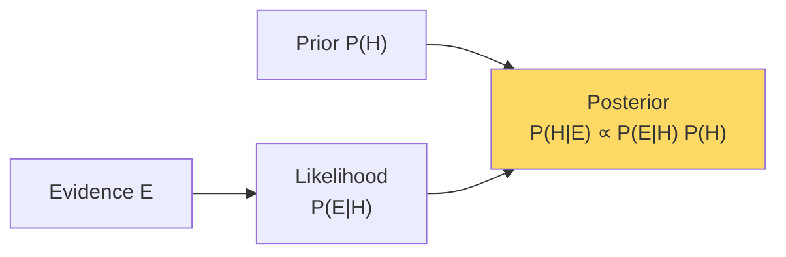

# Bayes' Theorem — Real-World Stories

> Confusing P(A|B) with P(B|A) costs airlines aircraft and customers their accounts.

## The Big Idea

Bayes flips a conditional around. Your test tells you "given the disease, how often does the test fire?" — but you actually need "given the test fired, do I have the disease?" The prior matters. Often more than the data does.



## Code: The Base-Rate Trap

```python
def posterior(prior, sensitivity, fpr):
    """P(disease | positive test)"""
    p_pos = sensitivity * prior + fpr * (1 - prior)
    return sensitivity * prior / p_pos

# "99% accurate" fraud model, fraud is rare (0.1% base rate)
print(posterior(prior=0.001, sensitivity=0.99, fpr=0.01))
# → 0.09 — most "fraud" alerts are false positives!

# Different prior: Singapore Black Friday (5% base rate)
print(posterior(prior=0.05, sensitivity=0.99, fpr=0.01))
# → 0.84 — same model, different prior, very different action
```

## Code: Online Bayesian Updating

```python
import numpy as np

alpha, beta = 1.0, 100.0  # prior: ~1% failure rate

flights = [("normal",)] * 200 + [("anomaly",)] * 5 + [("normal",)] * 50

for obs, in flights:
    if obs == "anomaly":
        alpha += 0.6
        beta  += 0.05
    else:
        alpha += 0.05
        beta  += 0.95

mean = alpha / (alpha + beta)
print(f"Updated failure-prob estimate: {mean:.4f}")
```

## Story 1: Amazon — Why a "99% Accurate" Fraud Model Blocks Real Customers

A fraud model that's 99% accurate sounds great. Apply it with a uniform prior and watch it block legitimate customers at 100x the right rate. Why? Because fraud is rare — most "positive" alerts are false alarms.

Amazon's fraud team bakes priors into scoring: a Singapore Black Friday transaction gets a *Singapore Black Friday* prior, not the global one. A Sunday-morning grocery purchase in Iowa gets a different one. Same model, different priors, very different decisions.

The model is the easy part. Knowing the right prior to apply is the engineering.

## Story 2: American Airlines — Why Grounding a Plane Needs a Posterior, Not an Alert

An engine sensor flags an anomaly. Should you ground the plane? Naive reading: "98% accurate detector, ground it." Real answer: failures are so rare that "98% accurate" still produces mostly false alarms.

AA's maintenance system uses Bayes online. Every safe flight is *evidence the engine is healthy* and updates the posterior downward. Every anomaly nudges it up. Grounding decisions come from the posterior probability, not from raw alerts. Otherwise you ground perfectly healthy aircraft constantly and ignore the few real signals.

## Remember This

- Always ask: what is the prior?
- P(disease | positive) and P(positive | disease) are rarely close. Confusing them creates either panic or complacency.
- Bayes makes systems *adaptive*: every observation updates beliefs.
