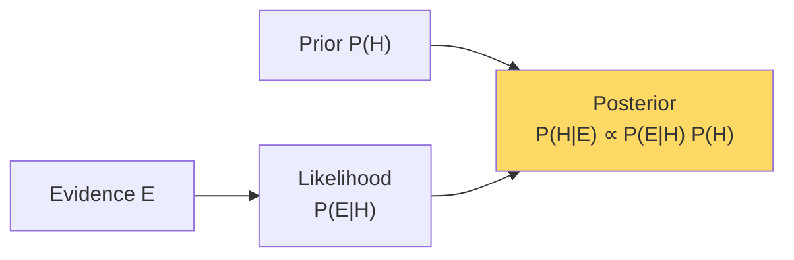

# Bayes' Theorem — Real-World Stories

> Confusing P(A|B) with P(B|A) costs airlines aircraft and customers their accounts.

## The Mental Model

Bayes inverts conditionals. Your sensor tells you P(evidence | hypothesis); you want P(hypothesis | evidence). The prior matters — sometimes more than the data.



## Code: The Base-Rate Trap

```python
def posterior(prior, sensitivity, fpr):
    """P(disease | positive test)"""
    p_pos_given_disease = sensitivity
    p_pos_given_no_disease = fpr
    p_pos = p_pos_given_disease * prior + p_pos_given_no_disease * (1 - prior)
    return p_pos_given_disease * prior / p_pos

# Highly accurate fraud model: 99% sensitivity, 1% FPR
# But fraud is rare: 0.1% prior
print(posterior(prior=0.001, sensitivity=0.99, fpr=0.01))
# → 0.09 — most "fraud" alerts are false positives!

# Wrong geo prior (Singapore Black Friday = high fraud)
print(posterior(prior=0.05, sensitivity=0.99, fpr=0.01))
# → 0.84 — same model, different prior, very different action
```

## Code: Online Bayesian Updating (Predictive Maintenance)

```python
import numpy as np

# Beta-Binomial: track P(engine fails this month) per engine
alpha, beta = 1.0, 100.0  # prior: ~1% failure rate

flights = [("normal",)] * 200 + [("anomaly",)] * 5 + [("normal",)] * 50

for obs, in flights:
    if obs == "anomaly":
        # Anomaly is weak evidence of impending failure: P(anomaly|failure)=0.6, P(anomaly|ok)=0.05
        # Bayesian update via likelihood ratio
        alpha += 0.6
        beta  += 0.05
    else:
        alpha += 0.05
        beta  += 0.95

mean = alpha / (alpha + beta)
print(f"Updated failure-prob estimate: {mean:.4f}")
```

## Amazon — Fraud Detection at Checkout

A "99% accurate" fraud model is useless if you apply a uniform prior. P(fraud) varies by geography, hour, channel, and seasonality. Engineers who built the system bake region- and time-specific priors directly into scoring. A Singapore Black Friday transaction gets the *Singapore Black Friday prior*, not the global one — otherwise legitimate customers are blocked at 100x the right rate.

## American Airlines — Predictive Maintenance

An engine sensor anomaly fires. P(failure | anomaly) is **not** P(anomaly | failure). The sensitivity of an anomaly detector vs the rarity of actual failure means a "98% accurate" detector still produces mostly false alarms. AA's modern maintenance pipeline uses Bayesian updating across every flight — each successful flight is *evidence the engine is healthy*, and updates the posterior downward. Ground decisions are based on posterior probability, not raw alerts.

## Takeaways

- Always ask: what is the prior?
- P(disease | positive) and P(positive | disease) are rarely close — confusing them creates either over- or under-reaction.
- Bayes makes systems *adaptive*: every observation updates beliefs.
