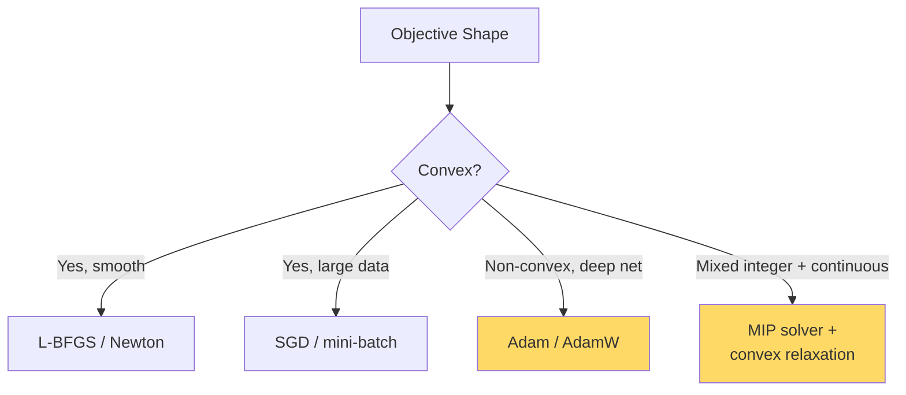

# Optimization — Real-World Stories

> The wrong optimizer doesn't fail loudly. It converges to a worse answer and ships.

## The Big Idea

Optimizers aren't interchangeable. Each one is tuned to a different shape of objective. Pick the wrong one and your model "trains fine" but lands in the wrong place.



## Code: Gradient Descent From Scratch

```python
import numpy as np

def f(x):    return (x - 3) ** 2 + 0.1 * x ** 4
def grad(x): return 2 * (x - 3) + 0.4 * x ** 3

x, lr = 10.0, 0.01
for _ in range(200):
    x -= lr * grad(x)
print(f"min ~ {x:.4f}, f = {f(x):.4f}")
```

## Code: Adam vs SGD on a Noisy Objective

```python
import numpy as np

def noisy_grad(x):
    return 2 * x + np.random.randn() * 5

x_sgd, lr = 10.0, 0.05
for _ in range(500):
    x_sgd -= lr * noisy_grad(x_sgd)

x_adam, m, v, t = 10.0, 0.0, 0.0, 0
b1, b2, eps = 0.9, 0.999, 1e-8
for _ in range(500):
    g = noisy_grad(x_adam)
    t += 1
    m = b1*m + (1-b1)*g
    v = b2*v + (1-b2)*g*g
    m_hat, v_hat = m/(1-b1**t), v/(1-b2**t)
    x_adam -= 0.05 * m_hat / (np.sqrt(v_hat) + eps)

print(f"SGD:  {x_sgd:.4f}")
print(f"Adam: {x_adam:.4f}")
```

## Code: Cosine Warm Restart

```python
def cosine_lr(step, base_lr, period):
    return 0.5 * base_lr * (1 + np.cos(np.pi * (step % period) / period))
```

## Story 1: Amazon — Why the Ads Bidder Learns Best With Cosine Warm Restarts

The ads auction bidder retrains every hour on fresh streaming data. Vanilla SGD oscillates badly at peak-traffic learning rates. Adam works better but over-fits to whichever hour was most recent.

The team tuned cosine warm restarts that matched traffic patterns: low learning rate overnight, fresh restart at the morning surge. Measurable CPC improvement.

The tuning came from someone who understood *why* each optimizer behaves the way it does — not from grid search.

## Story 2: American Airlines — Why "Where Should We Fly Next?" Needs a Different Solver

Picking new routes is non-convex with integer constraints (you can't fly 1.7 planes between two cities). Pure gradient methods are the wrong tool — they'll happily report a "solution" that doesn't respect the integer rules.

AA uses mixed-integer programming with convex relaxations and Lagrangian decomposition. Sounds heavy, but the pay-off is a *certifiable* answer: you know your solution is within X% of optimal. Engineers who can't tell convex from non-convex pick the wrong solver and can't prove anything.

## Remember This

- Every optimizer makes assumptions. Violate them and convergence breaks silently.
- LR schedules are part of the algorithm, not an afterthought.
- For mixed-integer: relax → solve → round, and *bound the gap*.
