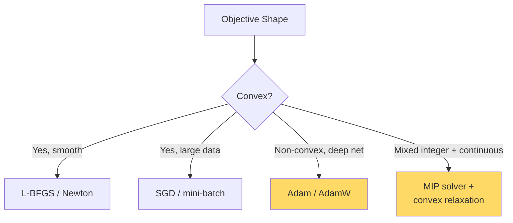

# Optimization — Real-World Stories

> The wrong optimizer doesn't fail loudly — it converges to a worse solution and ships.

## The Mental Model

Optimizers are not interchangeable. SGD, momentum, Adam, and second-order methods each match a different objective shape.



## Code: Gradient Descent From Scratch

```python
import numpy as np

def f(x):  return (x - 3) ** 2 + 0.1 * x ** 4
def grad(x): return 2 * (x - 3) + 0.4 * x ** 3

x = 10.0
lr = 0.01
for step in range(200):
    x -= lr * grad(x)
print(f"min ~ {x:.4f}, f = {f(x):.4f}")
```

## Code: Adam vs SGD on a Noisy Objective

```python
import numpy as np

def noisy_grad(x):
    return 2 * x + np.random.randn() * 5  # high variance

# SGD
x_sgd, lr = 10.0, 0.05
for _ in range(500):
    x_sgd -= lr * noisy_grad(x_sgd)

# Adam (simplified)
x_adam, m, v, t = 10.0, 0.0, 0.0, 0
b1, b2, eps = 0.9, 0.999, 1e-8
for _ in range(500):
    g = noisy_grad(x_adam)
    t += 1
    m = b1*m + (1-b1)*g
    v = b2*v + (1-b2)*g*g
    m_hat, v_hat = m/(1-b1**t), v/(1-b2**t)
    x_adam -= 0.05 * m_hat / (np.sqrt(v_hat) + eps)

print(f"SGD:  {x_sgd:.4f}")
print(f"Adam: {x_adam:.4f}")  # Adam typically more stable here
```

## Code: Learning-Rate Warm Restart

```python
def cosine_lr(step, base_lr, period):
    return 0.5 * base_lr * (1 + np.cos(np.pi * (step % period) / period))
```

## Amazon — Ads Auction Bidder

The bidder retrains hourly on streaming data. Vanilla SGD oscillates at peak-traffic learning rates; Adam over-fits to the most recent hour. The team tuned cosine warm restarts keyed to traffic patterns — low LR overnight, fresh restart at the morning surge. Result: meaningfully better CPC. The tuning came from someone who understood *why* each optimizer behaves the way it does.

## American Airlines — Route Network Optimization

"Where should we fly next?" is non-convex with integer constraints (slots are integer, aircraft assignments are integer). Pure gradient methods fail. The team uses MIP with convex relaxations and Lagrangian decomposition. Engineers who can't tell convex from non-convex pick the wrong solver — and prove nothing about optimality.

## Takeaways

- Every optimizer makes assumptions; violate them and convergence breaks silently.
- LR schedules are part of the algorithm, not an afterthought.
- For mixed-integer problems, relax → solve → round, and bound the gap.
