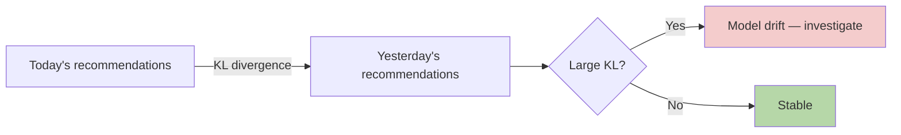

# Information Theory — Real-World Stories

> Entropy and KL divergence answer one question: "is this signal still telling me anything new?"

## The Big Idea

- **Entropy H(X)** — how uncertain X is.
- **Cross-entropy H(P, Q)** — how surprised Q is by P (your loss function for classification).
- **KL divergence D(P||Q)** — how different two distributions are.
- **Mutual information I(X;Y)** — how much knowing X tells you about Y.



## Code: Entropy, Cross-Entropy, KL

```python
import numpy as np

def entropy(p, eps=1e-12):
    p = np.asarray(p) + eps
    return -np.sum(p * np.log(p))

def kl(p, q, eps=1e-12):
    p, q = np.asarray(p) + eps, np.asarray(q) + eps
    return np.sum(p * np.log(p / q))

p_today     = np.array([0.10, 0.10, 0.30, 0.50])
p_yesterday = np.array([0.25, 0.25, 0.25, 0.25])

print("H(today)        =", entropy(p_today))
print("KL(today||yest) =", kl(p_today, p_yesterday))
```

## Code: Mutual Information for Feature Selection

```python
from sklearn.feature_selection import mutual_info_classif
import numpy as np

X = np.random.randn(1000, 10)
y = (X[:, 0] + 0.5 * X[:, 1] > 0).astype(int)

mi = mutual_info_classif(X, y)
for i, m in enumerate(mi):
    print(f"feature {i}: MI = {m:.4f}")
```

## Story 1: Amazon — When Customers Started Seeing the Same Five Items Every Day

Collaborative filtering recommenders sometimes collapse: the same handful of products show up for everyone. Customers feel like the homepage is broken.

The team tracks entropy of the daily recommendation distribution per customer. When entropy drops below a threshold, a diversity-aware re-ranker kicks in. They also use mutual information between user history and recommendations to tune the diversity/relevance trade-off explicitly — instead of guessing at weights.

## Story 2: American Airlines — Which Tiebreaker Actually Matters to This Customer

Two flights, same price, similar times. Which difference will move the booking? The model uses mutual information between feature deltas (layover length, aircraft type, time-of-day) and historical bookings to rank the tiebreakers.

Result: better top-3 click-through and fewer "back" clicks. The math doesn't tell you what users care about — it tells you which features carry real signal versus which are noise.

## Remember This

- Cross-entropy is the right classification loss because it measures "how wrong is my predicted distribution?"
- KL divergence is the right monitor for distribution drift.
- Mutual information selects features without assuming linearity.
