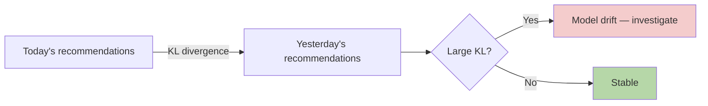

# Information Theory — Real-World Stories

> Entropy and KL divergence are how you measure "is this signal still telling me anything new?"

## The Mental Model

- **Entropy H(X)** — how uncertain X is.
- **Cross-entropy H(P, Q)** — how surprised Q is by P (your loss function for classification).
- **KL divergence D(P||Q)** — how different two distributions are.
- **Mutual information I(X;Y)** — how much knowing X tells you about Y.



## Code: Entropy, Cross-Entropy, KL

```python
import numpy as np

def entropy(p, eps=1e-12):
    p = np.asarray(p) + eps
    return -np.sum(p * np.log(p))

def kl(p, q, eps=1e-12):
    p, q = np.asarray(p) + eps, np.asarray(q) + eps
    return np.sum(p * np.log(p / q))

p_today     = np.array([0.10, 0.10, 0.30, 0.50])
p_yesterday = np.array([0.25, 0.25, 0.25, 0.25])

print("H(today)        =", entropy(p_today))
print("KL(today||yest) =", kl(p_today, p_yesterday))
```

## Code: Mutual Information for Feature Selection

```python
from sklearn.feature_selection import mutual_info_classif
import numpy as np

X = np.random.randn(1000, 10)
y = (X[:, 0] + 0.5 * X[:, 1] > 0).astype(int)  # only features 0 and 1 matter

mi = mutual_info_classif(X, y)
for i, m in enumerate(mi):
    print(f"feature {i}: MI = {m:.4f}")
```

## Amazon — Recommendation Diversity

Customers see the same five items repeatedly when collaborative filtering collapses. The team monitors entropy of the daily recommendation distribution per customer. When it drops below a threshold, a diversity-aware re-ranker kicks in. Mutual information between user history and recommendation lets them tune the trade-off explicitly rather than by hand-tuning weights.

## American Airlines — Flight Search Personalization

Two flights have identical price, similar times. Which difference matters most to *this* customer? The model uses mutual information between feature deltas (layover, aircraft type, time-of-day) and historical booking choices to rank tiebreakers. Result: better click-through on the top-3 suggestions and fewer "back" clicks.

## Takeaways

- Cross-entropy is your classification loss because it directly measures "how wrong is my predicted distribution?"
- KL divergence is the right monitor for distribution drift.
- Mutual information selects features without assuming linearity.
