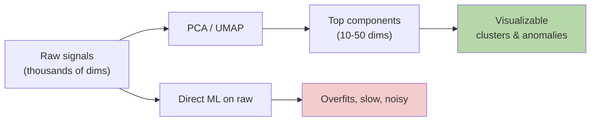

# Dimensionality Reduction — Real-World Stories

> You can't reason in 10,000 dimensions. The art is compressing without throwing away the signal that matters.

## The Mental Model

Dimensionality reduction finds the axes along which your data actually varies — and discards the rest. PCA is linear and fast; t-SNE/UMAP preserve local structure for visualization.



## Code: PCA From Scratch

```python
import numpy as np

X = np.random.randn(1000, 50)
X[:, 0] *= 5  # one dominant direction

# Center
Xc = X - X.mean(0)
# Covariance
C = Xc.T @ Xc / (len(Xc) - 1)
# Eigendecomposition
eigvals, eigvecs = np.linalg.eigh(C)
idx = np.argsort(eigvals)[::-1]
eigvals, eigvecs = eigvals[idx], eigvecs[:, idx]

# Variance explained
print("variance explained by top 5:",
      np.cumsum(eigvals[:5]) / eigvals.sum())

# Project to 5 dims
X_reduced = Xc @ eigvecs[:, :5]
```

## Code: Anomaly Detection in Reduced Space

```python
from sklearn.decomposition import PCA
from sklearn.svm import OneClassSVM
import numpy as np

# Simulated telemetry — 2000 sensors per flight
telemetry = np.random.randn(5000, 2000)
# Inject a few "weird" flights along a rare direction
weird = telemetry[:50].copy()
weird[:, 17] += 10
telemetry[:50] = weird

pca = PCA(n_components=20).fit(telemetry)
reduced = pca.transform(telemetry)

clf = OneClassSVM(gamma="auto").fit(reduced)
anomaly_scores = clf.decision_function(reduced)
print("most anomalous flights:", np.argsort(anomaly_scores)[:10])
```

## Amazon — Customer Segmentation

Amazon tracks thousands of behavioral signals per customer. PCA to ~50 components preserves >95% of variance, and the first 3 components reveal interpretable axes: spend level, browsing intensity, category breadth. "Lapsed Prime users" cluster visibly — a strategy doc writes itself from the scatter plot. Without reduction, the data is just a wall of numbers.

## American Airlines — Operational Anomaly Detection

Each flight emits ~2,000 telemetry signals. Reducing to 20 components and running one-class SVM lets dispatchers see "this flight is outside the normal envelope" pre-incident. The key insight: PCA *discards* low-variance directions — but anomalies often live there. AA uses both PCA (for typical operation) and a residual model (for the directions PCA discarded).

## Takeaways

- PCA finds linear axes of maximum variance. UMAP/t-SNE preserve local neighbors.
- Always check variance explained — if 50 dims explain 95%, your data wasn't really 2000-dim.
- For anomaly detection, monitor both the projection AND the residual.
