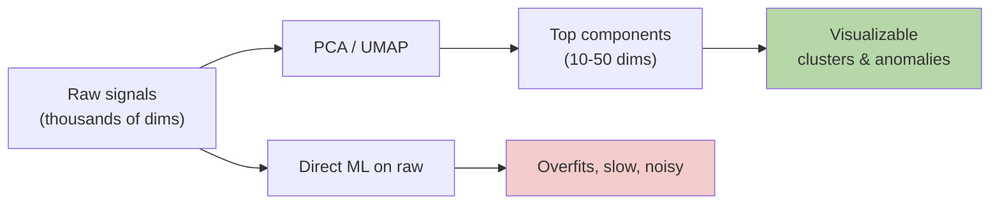

# Dimensionality Reduction — Real-World Stories

> You can't reason in 10,000 dimensions. The art is compressing without throwing away the signal that matters.

## The Big Idea

Dimensionality reduction finds the directions along which your data actually varies — and discards the rest. PCA is linear and fast; UMAP / t-SNE preserve local neighborhoods for visualization.



## Code: PCA From Scratch

```python
import numpy as np

X = np.random.randn(1000, 50)
X[:, 0] *= 5

Xc = X - X.mean(0)
C  = Xc.T @ Xc / (len(Xc) - 1)
eigvals, eigvecs = np.linalg.eigh(C)
idx = np.argsort(eigvals)[::-1]
eigvals, eigvecs = eigvals[idx], eigvecs[:, idx]

print("variance explained by top 5:",
      np.cumsum(eigvals[:5]) / eigvals.sum())

X_reduced = Xc @ eigvecs[:, :5]
```

## Code: Anomaly Detection in Reduced Space

```python
from sklearn.decomposition import PCA
from sklearn.svm import OneClassSVM
import numpy as np

telemetry = np.random.randn(5000, 2000)
weird = telemetry[:50].copy()
weird[:, 17] += 10
telemetry[:50] = weird

pca = PCA(n_components=20).fit(telemetry)
reduced = pca.transform(telemetry)

clf = OneClassSVM(gamma="auto").fit(reduced)
anomaly_scores = clf.decision_function(reduced)
print("most anomalous flights:", np.argsort(anomaly_scores)[:10])
```

## Story 1: Amazon — How a 50-Dimensional Picture Wrote a Strategy Doc

Amazon tracks thousands of behavioral signals per customer. Looking at the raw table tells you nothing — it's a wall of numbers.

PCA down to ~50 components keeps over 95% of the variance. The first three components turn out to be interpretable: spend level, browsing intensity, category breadth. Plot them, and "lapsed Prime users" form a visible cluster on the chart. A strategy doc almost writes itself.

The compression didn't lose signal. It exposed it.

## Story 2: American Airlines — Spotting Bad Flights Before They Become Incidents

Each flight emits about 2,000 telemetry signals. Doing anomaly detection on the raw stream is hopeless — too noisy, too high-dimensional.

AA reduces to 20 components and runs one-class SVM on those. Dispatchers see "this flight is outside the normal envelope" before anything bad happens.

One catch they learned: PCA *discards* low-variance directions, but real anomalies sometimes live exactly there. So they track both the PCA projection (typical operation) and the residual (the rare-direction signal). Two views are stronger than one.

## Remember This

- PCA finds linear axes of max variance. UMAP / t-SNE preserve local neighbors.
- Always check variance explained — if 50 dims explain 95%, your data wasn't really 2000-dim.
- For anomaly detection, watch both the projection AND the residual.
