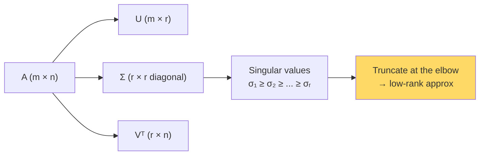

# Singular Value Decomposition (SVD) — Real-World Stories

> SVD is the universal factorization: PCA, recommender systems, embeddings compression, low-rank LoRA — all SVD underneath.

## The Mental Model

Any matrix `A = U Σ Vᵀ`. The singular values in Σ tell you how much "information" lives in each direction. Truncating to the top-k singular values gives the best rank-k approximation (Eckart-Young theorem).



## Code: SVD and Rank-k Approximation

```python
import numpy as np

# Random matrix with low effective rank
U_true = np.random.randn(1000, 10)
V_true = np.random.randn(10, 500)
A = U_true @ V_true + 0.01 * np.random.randn(1000, 500)

U, S, Vt = np.linalg.svd(A, full_matrices=False)
print("Top 15 singular values:", S[:15].round(2))
# Notice the elbow after ~10

# Reconstruct with rank 10
k = 10
A_k = U[:, :k] @ np.diag(S[:k]) @ Vt[:k, :]
print("Reconstruction error:", np.linalg.norm(A - A_k) / np.linalg.norm(A))
```

## Code: Compressing Embeddings

```python
import numpy as np

embeddings = np.random.randn(600_000, 1024).astype(np.float32)  # pretend product catalog

U, S, Vt = np.linalg.svd(embeddings, full_matrices=False)

# Plot S to find the elbow; truncate to rank 256
k = 256
compressed = U[:, :k] * S[:k]    # (N, 256)
basis      = Vt[:k, :]           # (256, 1024)

# Retrieval still works in compressed space:
# query_full @ basis.T  → query in compressed space
# then dot-product with `compressed`

original_bytes   = embeddings.nbytes
compressed_bytes = compressed.nbytes + basis.nbytes
print(f"Compression: {original_bytes / compressed_bytes:.2f}x")
```

## Amazon — Compressing Search Embeddings

Product embeddings are 1024-dim per item across ~600M items. SVD-truncated to rank 256 saves ~75% of storage with negligible recall loss (because the singular value spectrum decays sharply). Setting `k` required reading the spectrum and finding the elbow — too aggressive and recall tanks, too conservative and the savings vanish.

## American Airlines — Crew Schedule Compression

The feasible-pairings matrix is enormous, but ~99% of feasible schedules lie in a low-rank subspace defined by the constraint structure. SVD of the constraint matrix reveals that subspace; the optimizer then works in compressed coordinates, finishing overnight instead of days. Without SVD, the problem is computationally intractable at AA's scale.

## Takeaways

- Real-world matrices are rarely full-rank — the singular value spectrum tells the story.
- Truncated SVD = best rank-k approximation in Frobenius norm.
- Use SVD wherever you'd use PCA, recommender factorization, or LoRA — they're all the same idea.
