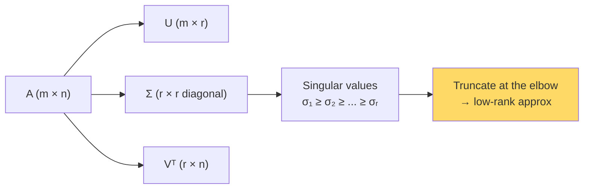

# Singular Value Decomposition (SVD) — Real-World Stories

> SVD is the universal factorization. PCA, recommender systems, embedding compression, LoRA — all SVD underneath.

## The Big Idea

Any matrix `A = U Σ Vᵀ`. The singular values in Σ tell you how much "information" lives along each direction. Keep only the top-k of them and you get the best possible rank-k approximation. That's the Eckart-Young theorem — and it's why compression works.



## Code: SVD and Rank-k Approximation

```python
import numpy as np

U_true = np.random.randn(1000, 10)
V_true = np.random.randn(10, 500)
A = U_true @ V_true + 0.01 * np.random.randn(1000, 500)

U, S, Vt = np.linalg.svd(A, full_matrices=False)
print("Top 15 singular values:", S[:15].round(2))
# Notice the elbow after ~10

k = 10
A_k = U[:, :k] @ np.diag(S[:k]) @ Vt[:k, :]
print("Reconstruction error:", np.linalg.norm(A - A_k) / np.linalg.norm(A))
```

## Code: Compressing Embeddings

```python
import numpy as np

embeddings = np.random.randn(600_000, 1024).astype(np.float32)

U, S, Vt = np.linalg.svd(embeddings, full_matrices=False)

k = 256
compressed = U[:, :k] * S[:k]    # (N, 256)
basis      = Vt[:k, :]           # (256, 1024)

original_bytes   = embeddings.nbytes
compressed_bytes = compressed.nbytes + basis.nbytes
print(f"Compression: {original_bytes / compressed_bytes:.2f}x")
```

## Story 1: Amazon — Cutting Embedding Storage by 75% Without Hurting Search

Amazon has product embeddings — 1024 numbers per item, ~600 million items. That's a lot of bytes.

SVD says: look at the singular values. They drop off sharply. Keep the top 256, throw the rest away, and reconstruction is nearly perfect. Storage drops by ~75%. Recall barely moves.

The trick was reading the spectrum. Too aggressive → recall tanks. Too conservative → no savings. The engineer who picked the right `k` looked at the singular value plot and found the elbow.

## Story 2: American Airlines — Why Crew Scheduling Finishes Overnight Instead of in Days

The matrix of feasible crew pairings is enormous. But — and this is the trick — about 99% of feasible schedules live in a low-rank subspace defined by the constraint structure.

SVD of the constraint matrix reveals that subspace. The optimizer then works in compressed coordinates: smaller matrices, faster math, the same final answer. Schedules finish overnight instead of taking days. At AA's scale, without SVD this problem isn't tractable.

## Remember This

- Real-world matrices are rarely full-rank. The singular value spectrum tells the story.
- Truncated SVD = best possible rank-k approximation (in Frobenius norm).
- Use SVD anywhere you'd use PCA, recommender factorization, or LoRA. Same idea.
