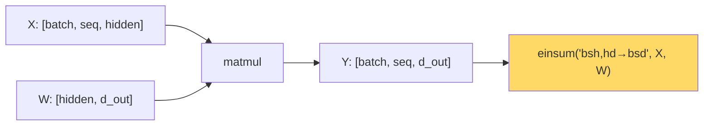

# Tensor Operations — Real-World Stories

> Once you can read `einsum("bsh,hd->bsd")` like English, transformer code stops being magic.

## The Mental Model

A tensor is an N-dimensional array. Operations on tensors are *contractions* along chosen axes. `einsum` makes the axes explicit and forces clarity.



## Code: Einsum Cheatsheet

```python
import numpy as np

# Batched matmul: [B, M, K] @ [B, K, N] = [B, M, N]
A = np.random.randn(8, 32, 16)
B = np.random.randn(8, 16, 24)
C = np.einsum("bmk,bkn->bmn", A, B)

# Attention scores: queries · keys^T per head
Q = np.random.randn(4, 8, 64, 32)   # [batch, head, seq, d_k]
K = np.random.randn(4, 8, 64, 32)
scores = np.einsum("bhsd,bhtd->bhst", Q, K)  # [batch, head, seq, seq]

# Demand-tensor slice: sum across days for one origin
demand = np.random.randn(50, 50, 7, 30, 6)  # [origin, dest, dow, days_out, fare_class]
total_by_route = np.einsum("oddyf->od", demand)  # too many d's — invalid!
total_by_route = demand.sum(axis=(2, 3, 4))      # axis-sum is the same idea
```

## Code: Why the Wrong Contraction Wastes Network

```python
import numpy as np
# Two equivalent computations — same result, very different communication cost in tensor-parallel:

# A: [batch, seq, hidden=4096], W: [hidden=4096, d_out=1024]
A = np.random.randn(64, 128, 4096)
W = np.random.randn(4096, 1024)

# Path 1: standard
Y1 = np.einsum("bsh,hd->bsd", A, W)

# Path 2: if W is split across devices along d_out, each device computes a slice
# and concatenates — no all-reduce needed.
# If W is split along `hidden`, each device computes partial sums, and an
# all-reduce is required — much more communication for the same result.
```

## Amazon — Trainium Tensor Parallelism

AWS Trainium chips split a `[batch, seq, hidden]` activation tensor across devices. Splitting the hidden axis on the right matmul keeps comms cheap; splitting wrong forces an all-reduce that dominates wall time. The AWS team writes Trainium-optimized kernels because they treat `einsum` notation as a *load-balancing language*, not just math.

## American Airlines — Demand Tensor

AA models demand as a 5D tensor `[origin, destination, day-of-week, days-out, fare-class]` — billions of cells. Common queries are tensor contractions: "all flights into MIA next Tuesday" sums along three axes. Doing this with pandas groupbys takes minutes; doing it with tensor contractions on a GPU takes milliseconds. Pricing engineers update fares 100x faster when they think in tensors.

## Takeaways

- `einsum` is a contract that names every axis — use it.
- The shape signature is documentation; if you can't write it, you don't understand the op.
- For distributed training, choosing *which axis* to split is a tensor-ops question.
