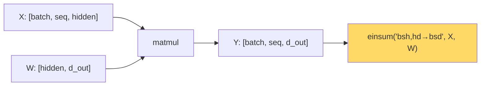

# Tensor Operations — Real-World Stories

> Once you can read `einsum("bsh,hd->bsd")` like English, transformer code stops being magic.

## The Big Idea

A tensor is an N-dimensional array. Operations on tensors are *contractions* along chosen axes. `einsum` names every axis explicitly — which forces clarity and prevents whole categories of bugs.



## Code: Einsum Cheatsheet

```python
import numpy as np

# Batched matmul: [B, M, K] @ [B, K, N] = [B, M, N]
A = np.random.randn(8, 32, 16)
B = np.random.randn(8, 16, 24)
C = np.einsum("bmk,bkn->bmn", A, B)

# Attention scores per head
Q = np.random.randn(4, 8, 64, 32)   # [batch, head, seq, d_k]
K = np.random.randn(4, 8, 64, 32)
scores = np.einsum("bhsd,bhtd->bhst", Q, K)

# Demand-tensor slice: sum across days for one origin
demand = np.random.randn(50, 50, 7, 30, 6)  # [origin, dest, dow, days_out, fare_class]
total_by_route = demand.sum(axis=(2, 3, 4))
```

## Code: Why the Wrong Contraction Wastes Network

```python
import numpy as np

A = np.random.randn(64, 128, 4096)
W = np.random.randn(4096, 1024)

# Standard path
Y1 = np.einsum("bsh,hd->bsd", A, W)

# Split W along d_out → no cross-device sync needed.
# Split W along hidden → every device computes a partial sum,
#   then an all-reduce. Same answer, way more network traffic.
```

## Story 1: Amazon — Why the Wrong Tensor Split Costs Hours of Training Time

AWS Trainium chips split a `[batch, seq, hidden]` activation tensor across many devices. Sounds boring. But *which axis* you split on decides whether the devices need to talk to each other constantly or barely at all.

Split the right axis on a given matmul → each device computes its slice independently, then concatenates. Cheap.
Split the wrong axis → every device computes a partial sum and you need a network-wide all-reduce. Expensive.

The AWS team writes their kernels by treating `einsum` notation as a *load-balancing language* — the axis letters tell you who needs to talk to whom.

## Story 2: American Airlines — Updating Fares 100x Faster by Thinking in Tensors

AA models demand as a 5D tensor: origin × destination × day-of-week × days-out × fare-class. Billions of cells.

A typical pricing question — "all flights into MIA next Tuesday" — is just summing three axes of that tensor. Done as pandas groupbys it takes minutes. Done as a tensor contraction on a GPU it takes milliseconds.

Pricing engineers who think in tensors update fares 100x faster. Same data, same answer — different mental model.

## Remember This

- `einsum` is a contract that names every axis. Use it.
- The shape signature *is* the documentation. If you can't write it, you don't understand the op.
- For distributed training, "which axis do I split on?" is a tensor-ops question.
