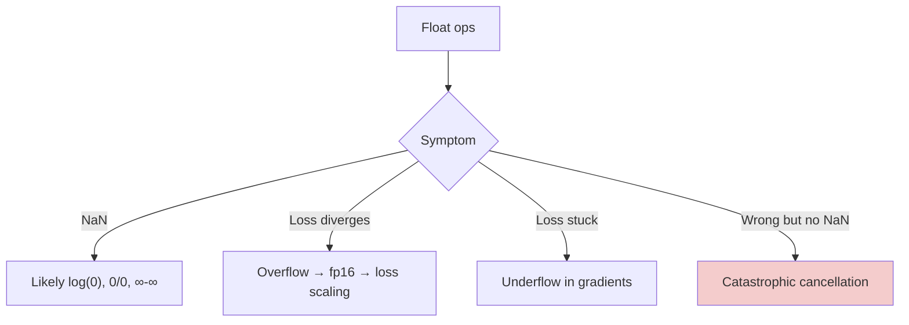

# Numerical Stability — Real-World Stories

> "The model just stopped learning." Nine times out of ten it's a numerical bug — underflow, overflow, or catastrophic cancellation.

## The Big Idea

Floats are not real numbers. They have finite precision. Things like `large - large`, `exp(very_big)`, or `log(0)` go wrong silently and poison whatever math runs next.



## Code: Logsumexp Done Right

```python
import numpy as np

def softmax_naive(x):
    e = np.exp(x)
    return e / e.sum()

def softmax_stable(x):
    x = x - x.max()
    e = np.exp(x)
    return e / e.sum()

x = np.array([1000., 1001., 1002.])
print(softmax_naive(x))   # nan or inf
print(softmax_stable(x))  # [0.09, 0.24, 0.67]
```

## Code: Catastrophic Cancellation

```python
import numpy as np

a = np.float32(1.0)
b = np.float32(1.0 + 1e-7)
print("fp32 a-b:", b - a)         # noise — digits gone

print("fp64 a-b:", np.float64(b) - np.float64(a))

# Algebraic rewrite avoids the subtraction:
# sqrt(1+x) - 1  →  x / (sqrt(1+x) + 1)
x = np.float32(1e-7)
bad  = np.sqrt(1 + x) - 1
good = x / (np.sqrt(1 + x) + 1)
print("bad =", bad, "good =", good)
```

## Code: Loss Scaling for fp16 Training

```python
import torch

scaler = torch.cuda.amp.GradScaler()
for x, y in []:  # placeholder loop
    with torch.cuda.amp.autocast():
        loss = ...
    scaler.scale(loss).backward()
    scaler.step(optimizer)
    scaler.update()
```

## Story 1: Amazon — Why a Big Language Model Trained in fp16 Quietly Stalled

Training a large language model in fp16 saves about half the memory. Great — until tiny gradients fall below what fp16 can represent. They round to zero. The model looks like it's training but learns nothing.

The fix: loss scaling. Multiply the loss by a big number before `.backward()`, then unscale the gradients before stepping. That pushes tiny gradients back into the representable range.

Without numerical-stability literacy, the team would have spent weeks blaming architecture choices. With it, the fix was a one-class wrapper around the optimizer.

## Story 2: American Airlines — How Catastrophic Cancellation Burned Tens of Millions in Forecasts

A revenue management solver was subtracting two nearly equal large numbers in fp32: forecasted revenue minus realized revenue, both around $1 billion. The difference — the model's actual error — was the size of cents.

But fp32 only has ~7 significant digits. Subtracting `1,000,000,000.00` from `1,000,000,000.05` gives you garbage, not five cents. Years of forecasts were corrupted by tens of millions before someone diagnosed it.

The fix: do that one subtraction in fp64. Literally one line. But finding it required knowing the phrase "catastrophic cancellation" exists.

## Remember This

- `softmax`, `logsumexp`, `log(p)` — all need numerically stable forms.
- Never subtract two near-equal numbers. Rewrite the formula instead.
- Mixed precision needs loss scaling. "Model not learning" + fp16 = suspect underflow first.
