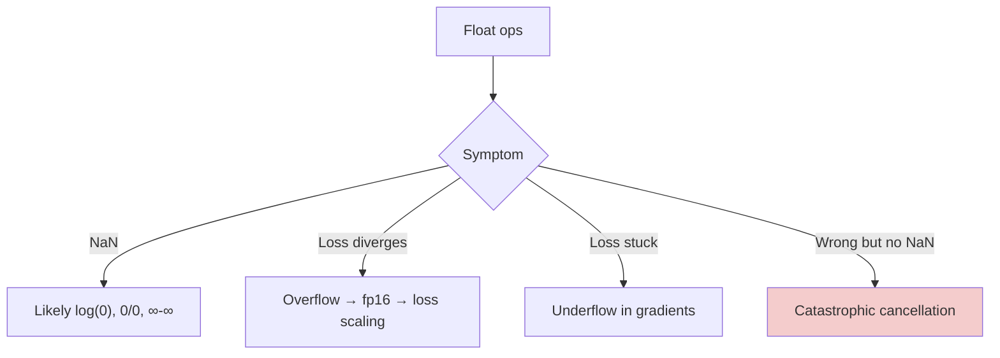

# Numerical Stability — Real-World Stories

> "The model just stopped learning." 90% of the time it's a numerical bug — underflow, overflow, or catastrophic cancellation.

## The Mental Model

Floats are not real numbers. They have finite precision. Operations like `large - large`, `exp(big)`, `log(0)` go wrong silently and corrupt downstream math.



## Code: Logsumexp Done Right

```python
import numpy as np

# Naive — overflows for large logits
def softmax_naive(x):
    e = np.exp(x)
    return e / e.sum()

# Stable — subtract max first
def softmax_stable(x):
    x = x - x.max()
    e = np.exp(x)
    return e / e.sum()

x = np.array([1000., 1001., 1002.])
print(softmax_naive(x))   # nan or inf
print(softmax_stable(x))  # [0.09, 0.24, 0.67]
```

## Code: Catastrophic Cancellation

```python
import numpy as np

# Subtracting near-equal numbers in fp32
a = np.float32(1.0)
b = np.float32(1.0 + 1e-7)
print("fp32 a-b:", b - a)         # noise — most digits lost

# In fp64 it's fine
print("fp64 a-b:", np.float64(b) - np.float64(a))

# Algebraic rewrites avoid the subtraction:
# Instead of  sqrt(1+x) - 1, use  x / (sqrt(1+x) + 1)
x = np.float32(1e-7)
bad  = np.sqrt(1 + x) - 1
good = x / (np.sqrt(1 + x) + 1)
print("bad =", bad, "good =", good)
```

## Code: Loss Scaling for fp16 Training

```python
import torch

scaler = torch.cuda.amp.GradScaler()
for x, y in []:  # placeholder loop
    with torch.cuda.amp.autocast():
        loss = ...
    scaler.scale(loss).backward()   # scale up so tiny grads don't underflow
    scaler.step(optimizer)          # unscale and step
    scaler.update()
```

## Amazon — Mixed Precision on AWS Training Clusters

Training a large language model in fp16 saves ~50% memory but underflows tiny gradients silently — the model appears to stall. AWS's training teams introduced loss scaling (multiply loss by a large factor before backward, unscale grads before stepping) to keep gradients in fp16's representable range. Without numerical-stability literacy, engineers would chase architecture changes for weeks and never find the issue.

## American Airlines — Revenue Management Catastrophic Cancellation

A revenue management solver was subtracting two near-equal large numbers in fp32: forecasted vs realized revenue, both around $1B. The difference (the model's error) was the size of cents — but fp32 only has ~7 significant digits, so the result was pure noise. Projections were corrupted by tens of millions. The fix: do that specific subtraction in fp64. One line. Only an engineer who knew the term "catastrophic cancellation" by name could diagnose it.

## Takeaways

- `softmax`, `logsumexp`, and `log(p)` all need numerically stable forms.
- Cancellation: avoid subtracting two near-equal numbers — rewrite algebraically.
- Mixed precision needs loss scaling; "model not learning" + fp16 = suspect underflow first.
