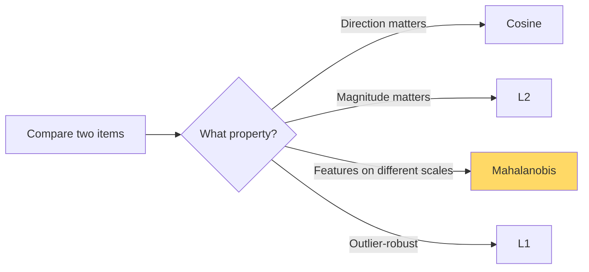

# Norms & Distances — Real-World Stories

> "Similar" means nothing until you pick a distance. Picking the wrong one is a bug, not a style choice.

## The Big Idea

Different norms answer different questions. Pick by what you mean by "close":

| Norm | Measures | When to use |
| --- | --- | --- |
| L1 (Manhattan) | Sum of \|differences\| | Robust to outliers; encourages sparse solutions |
| L2 (Euclidean) | Root-sum-squares | Smooth optimization; assume Gaussian noise |
| L∞ | Max difference | Worst-case bounds |
| Cosine | Angle | Direction matters, magnitude doesn't |
| Mahalanobis | Scaled by covariance | Features on different scales / correlated |



## Code: Five Distances on the Same Pair

```python
import numpy as np

a = np.array([100.0, 0.5, 3])    # price $, duration_hrs, stops
b = np.array([110.0, 0.6, 4])

print("L1 :", np.sum(np.abs(a - b)))
print("L2 :", np.linalg.norm(a - b))
print("L∞ :", np.max(np.abs(a - b)))
print("cos:", a @ b / (np.linalg.norm(a) * np.linalg.norm(b)))

data = np.random.randn(1000, 3) * np.array([50, 0.3, 1.5])
S_inv = np.linalg.inv(np.cov(data, rowvar=False))
diff = a - b
print("mhl:", np.sqrt(diff @ S_inv @ diff))
```

## Code: Why L2 on Raw Features Is Wrong

```python
a = np.array([100.0, 0.5, 3])
b = np.array([100.0, 5.0, 3])   # huge difference in hours

c = np.array([110.0, 0.5, 3])   # $10 difference, same hours

print("L2(a,b) =", np.linalg.norm(a - b))   # 4.5
print("L2(a,c) =", np.linalg.norm(a - c))   # 10 — but should feel closer to a
```

## Story 1: Amazon — When "Distance" Was the Reason Visual Search Worked Better

"Show me products that look like this picture" runs on embedding similarity. The fashion team A/B-tested two choices: cosine versus L2 on normalized vectors.

L2 won. Why? Because the embedding's *magnitude* turned out to encode popularity. Customers preferred the popular look-alikes. L2 kept that magnitude information; cosine threw it away.

What looked like a stylistic call — "should we use cosine?" — moved conversion. Distance choice is modeling.

## Story 2: American Airlines — Why "Similar Flights" Needs Mahalanobis, Not L1

L1 distance on `(price_$, duration_min, stops)` treats $50 the same as 50 minutes. That's nonsense — a $50 price difference and a 50-minute duration difference are nowhere near equivalent in customer perception.

AA.com uses Mahalanobis distance with the covariance learned from actual booking history. That bakes in how customers *actually* trade off price, time, and stops. A user who values cheap-and-short gets a different "similar" set than one who values direct-at-any-price. Same query, customized similarity.

## Remember This

- Distance is a modeling choice. State it explicitly.
- Normalize *before* using L2, or use Mahalanobis to bake the scaling in.
- Cosine ignores magnitude. Sometimes that's right. Sometimes it's a bug.
