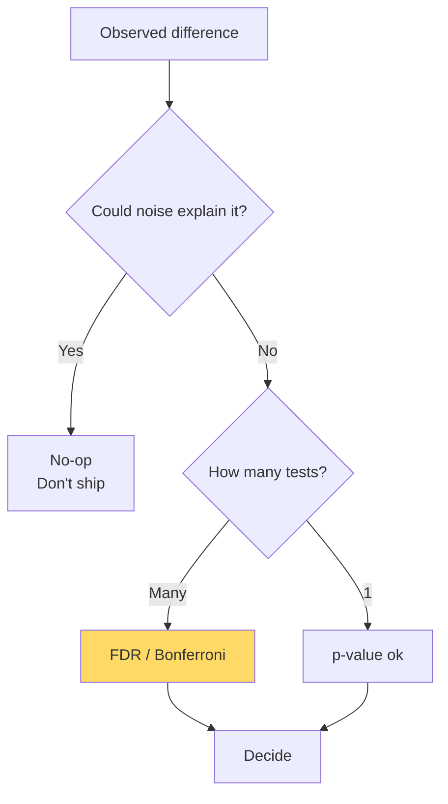

# Statistics for ML — Real-World Stories

> A p-value of 0.04 in one of 1000 tests is noise. Not knowing that ships bad features.

## The Mental Model

Statistical thinking is about distinguishing signal from noise. Hypothesis tests, confidence intervals, and multiple-testing corrections are tools for that distinction.



## Code: Bootstrap CI (Distribution-Free)

```python
import numpy as np

def bootstrap_ci(data, stat_fn, B=10_000, alpha=0.05):
    n = len(data)
    stats = np.empty(B)
    for i in range(B):
        sample = data[np.random.randint(0, n, n)]
        stats[i] = stat_fn(sample)
    lo, hi = np.percentile(stats, [100*alpha/2, 100*(1-alpha/2)])
    return stats.mean(), lo, hi

data = np.random.lognormal(2.0, 1.5, size=500)
mean, lo, hi = bootstrap_ci(data, np.mean)
print(f"mean = {mean:.2f}  95% CI = [{lo:.2f}, {hi:.2f}]")
```

## Code: FDR Control

```python
import numpy as np

def benjamini_hochberg(pvals, q=0.05):
    pvals = np.asarray(pvals)
    n = len(pvals)
    order = np.argsort(pvals)
    sorted_p = pvals[order]
    thresholds = q * np.arange(1, n+1) / n
    passes = sorted_p <= thresholds
    if not passes.any():
        return np.zeros(n, dtype=bool)
    cutoff_rank = np.max(np.where(passes)[0])
    cutoff = sorted_p[cutoff_rank]
    return pvals <= cutoff

ps = np.concatenate([np.random.uniform(0, 1, 990), np.random.uniform(0, 0.01, 10)])
print("rejections:", benjamini_hochberg(ps, q=0.05).sum())
```

## Code: Hierarchical Pooling for Rare Events

```python
# Pilot training: did simulator scenario reduce go-arounds?
# Each pilot has few observations; pool via hierarchical mean.
import numpy as np

per_pilot_rates = np.random.beta(2, 100, size=14_000)  # tiny rates
overall_rate = per_pilot_rates.mean()
# Shrinkage: per-pilot estimate moves toward overall_rate proportional to noise
```

## Amazon — Experimentation Platform

Amazon runs ~10,000 experiments simultaneously. Without multiple-testing correction, you'd see ~500 false "wins" a day — and ship 500 random changes. The platform enforces sequential testing (mSPRT) and FDR control by default. Anyone launching a feature has to *read* the experiment report, not just see "green." Statistics literacy is a hiring filter for the team.

## American Airlines — Pilot Training Analytics

Did the new simulator scenario reduce go-arounds? With ~14,000 pilots and rare events (go-arounds are infrequent), naive per-pilot comparisons are dominated by noise. The training analytics team uses hierarchical models that pool across pilots while preserving individual variance. Rolling out a training change that *looks* like it works but doesn't replicate is worse than no training change.

## Takeaways

- Confidence intervals beat p-values for decision-making.
- Multiple testing destroys naive p-values — always correct.
- For rare-event metrics, use hierarchical / Bayesian shrinkage.
