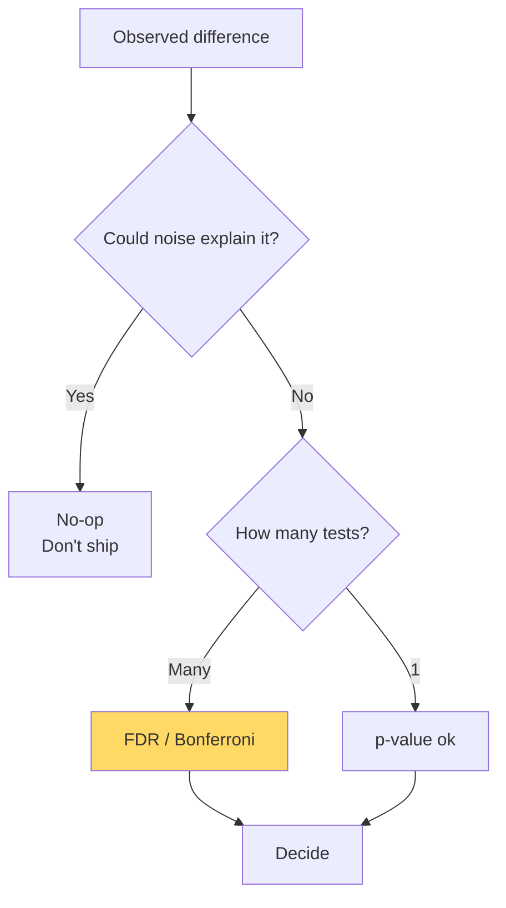

# Statistics for ML — Real-World Stories

> A p-value of 0.04 in one of 1,000 tests is noise. Not knowing that ships bad features.

## The Big Idea

Statistics is about separating signal from noise. Hypothesis tests, confidence intervals, and multiple-testing corrections are the tools for that job. Skip them and you'll celebrate randomness.



## Code: Bootstrap CI (No Distribution Assumed)

```python
import numpy as np

def bootstrap_ci(data, stat_fn, B=10_000, alpha=0.05):
    n = len(data)
    stats = np.empty(B)
    for i in range(B):
        sample = data[np.random.randint(0, n, n)]
        stats[i] = stat_fn(sample)
    lo, hi = np.percentile(stats, [100*alpha/2, 100*(1-alpha/2)])
    return stats.mean(), lo, hi

data = np.random.lognormal(2.0, 1.5, size=500)
mean, lo, hi = bootstrap_ci(data, np.mean)
print(f"mean = {mean:.2f}  95% CI = [{lo:.2f}, {hi:.2f}]")
```

## Code: FDR Control

```python
import numpy as np

def benjamini_hochberg(pvals, q=0.05):
    pvals = np.asarray(pvals)
    n = len(pvals)
    order = np.argsort(pvals)
    sorted_p = pvals[order]
    thresholds = q * np.arange(1, n+1) / n
    passes = sorted_p <= thresholds
    if not passes.any():
        return np.zeros(n, dtype=bool)
    cutoff_rank = np.max(np.where(passes)[0])
    cutoff = sorted_p[cutoff_rank]
    return pvals <= cutoff

ps = np.concatenate([np.random.uniform(0, 1, 990), np.random.uniform(0, 0.01, 10)])
print("rejections:", benjamini_hochberg(ps, q=0.05).sum())
```

## Story 1: Amazon — Why 500 False "Wins" a Day Would Ruin the Site

Amazon runs ~10,000 experiments at once. Without any correction for multiple testing, you'd expect about 500 features per day to look like wins purely by chance. Imagine shipping 500 random changes a day. The site would become a noise machine.

The internal experimentation platform enforces sequential testing and false-discovery-rate control by default. You can't ship just because the dashboard turned green — you have to actually *read* the report. Statistics literacy is a hiring filter for the team.

## Story 2: American Airlines — Did the Simulator Training Actually Reduce Go-Arounds?

AA wanted to know: did the new simulator scenario reduce go-arounds? With 14,000 pilots and go-arounds being rare events, naive per-pilot comparisons drowned in noise. Each pilot just doesn't have enough flights to measure.

The team used hierarchical models that pool information across pilots while still tracking individual variance. The result is an estimate you can actually trust. Rolling out training that *looks* like it works but doesn't replicate is worse than no training at all — pilots lose faith.

## Remember This

- Confidence intervals beat p-values for decision-making.
- Multiple testing destroys naive p-values. Always correct.
- For rare-event metrics, use hierarchical or Bayesian shrinkage.
