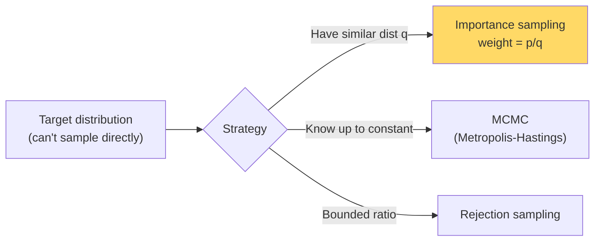

# Sampling Methods — Real-World Stories

> When you can't compute an expectation exactly, you sample. Counterfactual evaluation and Monte Carlo stress tests are built entirely on this idea.

## The Big Idea

Sampling estimates an integral or expectation by drawing random points and averaging. Importance sampling, MCMC, and rejection sampling each handle a different flavor of "I can't draw from this distribution directly."



## Code: Importance Sampling

```python
import numpy as np

# Estimate E_p[f(x)] where x ~ p, using samples from q
# p = N(2, 1), q = N(0, 2), f(x) = x^2

samples = np.random.normal(0, 2, size=100_000)
f_vals  = samples ** 2

def pdf(x, mu, sigma):
    return np.exp(-0.5 * ((x - mu) / sigma) ** 2) / (sigma * np.sqrt(2*np.pi))

weights = pdf(samples, 2, 1) / pdf(samples, 0, 2)
estimate = np.mean(weights * f_vals)
print(f"E_p[x²] ≈ {estimate:.3f}  (true: 5.0)")
```

## Code: Monte Carlo Schedule Stress Test

```python
import numpy as np

def simulate_day(weather_p_storm, crew_sick_rate, mech_fail_rate):
    flights = 6700
    storms  = np.random.binomial(flights, weather_p_storm)
    sick    = np.random.binomial(flights, crew_sick_rate)
    mech    = np.random.binomial(flights, mech_fail_rate)
    cancellations = storms + sick + mech - 0.3 * min(storms, sick)
    return cancellations

n_runs = 10_000
results = np.array([simulate_day(0.05, 0.02, 0.005) for _ in range(n_runs)])
print(f"P(>200 cancels) = {(results > 200).mean():.3f}")
print(f"95th percentile = {np.percentile(results, 95):.0f}")
```

## Code: Off-Policy Evaluation (Counterfactual)

```python
import numpy as np

n = 10_000
actions = np.random.randint(0, 5, n)
rewards = np.random.randn(n) + (actions == 2) * 0.5

p_log = np.ones(n) / 5
p_new = (actions == 2).astype(float)

ips_estimate = np.mean(rewards * p_new / p_log)
print(f"IPS estimate of new policy reward: {ips_estimate:.3f}")
```

## Story 1: Amazon — How to A/B Test a New Ranker Without Actually A/B Testing

"If we had shown ranking B instead of A, would revenue have been higher?" The honest answer is "we can't know — we didn't show B." But replaying history with inverse propensity scoring on the logged data gives a useful estimate.

The team uses this to filter most candidate models *offline*. Only the survivors get actual A/B test traffic. That saves months of test budget and lets engineers iterate way faster.

## Story 2: American Airlines — Sizing the Schedule for a Hurricane That Hasn't Happened Yet

"If a Category-3 hurricane hits Miami, how badly does the network degrade?" You can't run that experiment — you'd need an actual hurricane. So the Integrated Ops Center runs Monte Carlo: thousands of simulated days, each with random weather, crew sickness, and mechanical issues.

The 95th-percentile delay tells planning how much slack to bake into the schedule before hurricane season. Sampling turns "what if X happens?" from a debate into a number.

## Remember This

- Importance sampling unlocks counterfactual evaluation — a huge time saver versus A/B testing.
- Monte Carlo converts "what if?" into a real number with a confidence interval.
- Sample size matters. Report intervals, not just point estimates.
