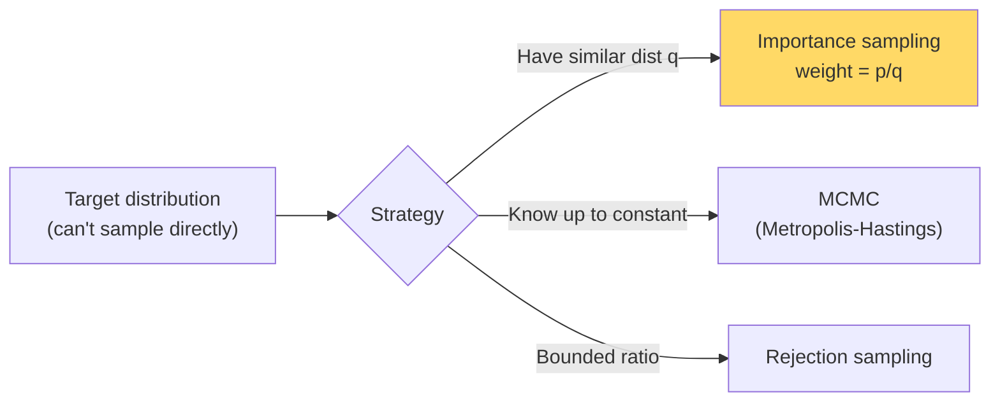

# Sampling Methods — Real-World Stories

> When you can't compute an expectation exactly, you sample. Counterfactual evaluation and Monte Carlo stress tests are entirely built on this idea.

## The Mental Model

Sampling estimates an integral or expectation by drawing random points and averaging. Importance sampling, MCMC, and rejection sampling each handle a different shape of "I can't sample from this directly."



## Code: Importance Sampling

```python
import numpy as np

# Estimate E_p[f(x)] where x ~ p, using samples from q
# p = N(2, 1), q = N(0, 2), f(x) = x^2

samples = np.random.normal(0, 2, size=100_000)         # from q
f_vals  = samples ** 2

def pdf(x, mu, sigma):
    return np.exp(-0.5 * ((x - mu) / sigma) ** 2) / (sigma * np.sqrt(2*np.pi))

weights = pdf(samples, 2, 1) / pdf(samples, 0, 2)
estimate = np.mean(weights * f_vals)
print(f"E_p[x²] ≈ {estimate:.3f}  (true: 5.0)")
```

## Code: Monte Carlo Schedule Stress Test

```python
import numpy as np

def simulate_day(weather_p_storm, crew_sick_rate, mech_fail_rate):
    flights = 6700
    storms  = np.random.binomial(flights, weather_p_storm)
    sick    = np.random.binomial(flights, crew_sick_rate)
    mech    = np.random.binomial(flights, mech_fail_rate)
    cancellations = storms + sick + mech - 0.3 * min(storms, sick)  # toy interaction
    return cancellations

n_runs = 10_000
results = np.array([simulate_day(0.05, 0.02, 0.005) for _ in range(n_runs)])
print(f"P(>200 cancels) = {(results > 200).mean():.3f}")
print(f"95th percentile = {np.percentile(results, 95):.0f}")
```

## Code: Off-Policy Evaluation (Counterfactual)

```python
import numpy as np

# Logged data: action a_i was taken under policy π_log; reward r_i observed.
# We want to evaluate a new policy π_new.

n = 10_000
actions = np.random.randint(0, 5, n)
rewards = np.random.randn(n) + (actions == 2) * 0.5  # action 2 is best

# Propensity under logging policy (uniform)
p_log = np.ones(n) / 5

# Importance weight under a deterministic new policy: always action 2
p_new = (actions == 2).astype(float)

ips_estimate = np.mean(rewards * p_new / p_log)
print(f"IPS estimate of new policy reward: {ips_estimate:.3f}")
```

## Amazon — Counterfactual Ranking Evaluation

"If we had shown ranking B instead of A, would revenue have been higher?" Replaying history is impossible. Inverse propensity scoring on logged data estimates the counterfactual without a new A/B test. Engineers who use this rule out *most* candidate models offline and only A/B-test the survivors — saving months of test traffic.

## American Airlines — Hurricane Schedule Stress Test

"If a Cat-3 hurricane hits MIA, how degraded is the network?" The IOC runs Monte Carlo over weather, crew-sick, and aircraft-out distributions, simulating thousands of plausible days. The 95th-percentile delay tells them how much slack to build into the schedule before the season. This is sampling done at planning scale.

## Takeaways

- Importance sampling unlocks counterfactual evaluation — huge time saver vs A/B tests.
- Monte Carlo turns "what if X happens?" from speculation into a number.
- Sample size matters: report intervals, not just point estimates.
