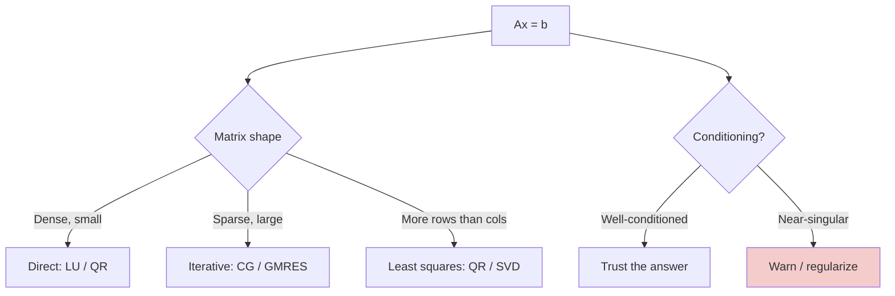

# Linear Systems — Real-World Stories

> Solving `Ax = b` is everywhere — regression, Kalman filters, weight-and-balance, route ETAs.

## The Big Idea

Solve directly (LU, QR) for small dense systems. Solve iteratively (CG, GMRES) for big sparse ones. And always check conditioning — it tells you whether the answer you got is trustworthy.



## Code: Direct vs Iterative

```python
import numpy as np
from scipy.sparse.linalg import cg
from scipy.sparse import random as sparse_rand

A = np.random.randn(500, 500)
A = A @ A.T + np.eye(500)
b = np.random.randn(500)
x_direct = np.linalg.solve(A, b)
print("residual:", np.linalg.norm(A @ x_direct - b))

S = sparse_rand(10_000, 10_000, density=0.001, format="csr")
S = S @ S.T + 10 * np.eye(10_000) * 1
b2 = np.random.randn(10_000)
x_iter, info = cg(S, b2, atol=1e-8)
```

## Code: Detecting Ill-Conditioning

```python
import numpy as np

A = np.array([[1.0, 2.0, 3.0],
              [2.0, 4.0001, 6.0],
              [3.0, 6.0, 9.0001]])

print("condition number:", np.linalg.cond(A))
# > 1e8 → warn the user

b = np.array([1, 2, 3], dtype=float)
x, residuals, rank, sv = np.linalg.lstsq(A, b, rcond=None)
print("x =", x, "  rank =", rank)
```

## Code: Least Squares ETA Model

```python
import numpy as np

N = 1000
X = np.random.randn(N, 5)
y = X @ np.array([2.0, -1.0, 0.5, 0.0, 1.5]) + 0.1 * np.random.randn(N)

# Avoid normal equations — they square the condition number.
Q, R = np.linalg.qr(X)
beta = np.linalg.solve(R, Q.T @ y)
print(beta)
```

## Story 1: Amazon — Why Manhattan and Rural Texas Need Different Solvers

Last-mile ETA models all solve a least-squares problem per route. But the matrix shape changes by geography.

In Manhattan, the graph is dense and constrained — sparse matrix structure makes iterative methods (conjugate gradient) finish in milliseconds. In rural Texas, the matrices are smaller and denser — direct LU is faster.

The engineer who knows when to switch keeps ETAs accurate everywhere and the pipeline cheap. The engineer who picks one solver "because it works in dev" leaves perf on the table.

## Story 2: American Airlines — Why a Plane Doesn't Take Off Until the Condition Number Checks Out

Every takeoff solves a linear system to compute center-of-gravity given the load. Normally the matrix is well-behaved. But irregular cargo — say, a single very heavy item in the back — can make the matrix nearly singular. The solver still returns an answer, but the answer is unstable.

Dispatch software checks the condition number first and refuses to proceed if it's too high. Without that check, takeoffs would be technically "legal" by the numbers and quietly dangerous in edge cases.

## Remember This

- Don't solve normal equations directly. Use QR/SVD for stable least squares.
- Always check the condition number before trusting the solution.
- Iterative solvers for sparse + huge. Direct solvers for small + dense.
