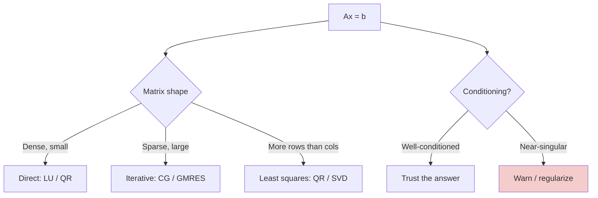

# Linear Systems — Real-World Stories

> Solving `Ax = b` is everywhere — regression, Kalman filters, weight-and-balance, route ETAs.

## The Mental Model

A linear system can be solved directly (Gaussian elimination, LU) or iteratively (CG, GMRES). The choice depends on the matrix: dense → direct, sparse and large → iterative. Conditioning tells you whether the answer is trustworthy.



## Code: Direct vs Iterative

```python
import numpy as np
from scipy.sparse.linalg import cg
from scipy.sparse import random as sparse_rand

# Dense small — direct
A = np.random.randn(500, 500)
A = A @ A.T + np.eye(500)        # SPD
b = np.random.randn(500)
x_direct = np.linalg.solve(A, b)
print("residual:", np.linalg.norm(A @ x_direct - b))

# Sparse large — iterative
S = sparse_rand(10_000, 10_000, density=0.001, format="csr")
S = S @ S.T + 10 * np.eye(10_000) * 1  # crude SPD
b2 = np.random.randn(10_000)
x_iter, info = cg(S, b2, atol=1e-8)
```

## Code: Detecting Ill-Conditioning

```python
import numpy as np

# Slightly singular matrix
A = np.array([[1.0, 2.0, 3.0],
              [2.0, 4.0001, 6.0],
              [3.0, 6.0, 9.0001]])

print("condition number:", np.linalg.cond(A))
# > 1e8 → warn the user; the solution will be unstable

# Use SVD-based pseudo-inverse to get a stable least-squares answer
b = np.array([1, 2, 3], dtype=float)
x, residuals, rank, sv = np.linalg.lstsq(A, b, rcond=None)
print("x =", x, "  rank =", rank)
```

## Code: Least Squares ETA Model

```python
import numpy as np

# Predict ETA from features: traffic, distance, time-of-day
N = 1000
X = np.random.randn(N, 5)
y = X @ np.array([2.0, -1.0, 0.5, 0.0, 1.5]) + 0.1 * np.random.randn(N)

# Solve normal equations? No — they square the condition number.
# Use QR directly:
Q, R = np.linalg.qr(X)
beta = np.linalg.solve(R, Q.T @ y)
print(beta)
```

## Amazon — Last-Mile Routing & ETAs

Last-mile ETA models solve a least-squares problem per route. In dense Manhattan (sparse adjacency, lots of constraints), iterative methods (CG) finish in milliseconds. In rural Texas (dense matrices but smaller), direct LU is faster. The engineer who knows when to switch keeps ETAs accurate and the pipeline cheap.

## American Airlines — Weight & Balance

Every takeoff solves a linear system for center-of-gravity given the load. The matrix is normally well-conditioned, but irregular cargo (a single heavy item) can produce a near-singular matrix — the solution is mathematically valid but unstable. Dispatch software checks the condition number and *refuses* to proceed if it's too high. Without that check, takeoffs would be technically legal but unsafe in edge cases.

## Takeaways

- Don't solve normal equations directly — use QR/SVD for stable least squares.
- Always check the condition number before trusting a solution.
- Iterative solvers shine on sparse matrices; direct solvers shine on small dense ones.
