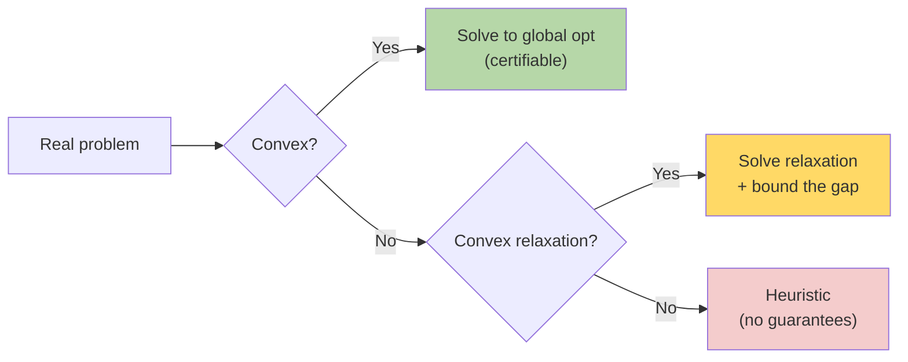

# Convex Optimization — Real-World Stories

> A convex problem has one minimum — and you can prove it. A non-convex one might hide a $10M better answer you'll never find.

## The Mental Model

If both the objective and the feasible region are convex, every local minimum is the global minimum. Identifying convex structure (or a convex relaxation of a hard problem) is half the battle.



## Code: Convex QP for Portfolio Hedging

```python
import cvxpy as cp
import numpy as np

# 5 fuel hedging instruments; pick allocations to minimize variance s.t. cover X gallons
n = 5
prices = np.array([3.1, 3.0, 3.2, 2.95, 3.05])
Sigma  = np.array([[0.04, 0.01, 0.00, 0.00, 0.01],
                   [0.01, 0.05, 0.00, 0.01, 0.00],
                   [0.00, 0.00, 0.06, 0.00, 0.02],
                   [0.00, 0.01, 0.00, 0.03, 0.00],
                   [0.01, 0.00, 0.02, 0.00, 0.04]])
target_gallons = 1_000_000

x = cp.Variable(n, nonneg=True)
objective = cp.Minimize(cp.quad_form(x, cp.psd_wrap(Sigma)))
constraints = [cp.sum(x) == target_gallons, x @ prices <= 3.15 * target_gallons]
prob = cp.Problem(objective, constraints)
prob.solve()
print("optimal alloc:", x.value)
print("variance:    ", prob.value)
```

## Code: LP Relaxation of an Integer Problem

```python
import cvxpy as cp
import numpy as np

# Assign K items to N bins to minimize cost — relax binary x to [0,1]
N, K = 20, 50
cost = np.random.rand(N, K)

x = cp.Variable((N, K))                       # relaxation: continuous
prob = cp.Problem(
    cp.Minimize(cp.sum(cp.multiply(cost, x))),
    [x >= 0, x <= 1, cp.sum(x, axis=0) == 1]   # each item to one bin
)
prob.solve()
print("LP relaxation lower bound:", prob.value)
# Round to integer; bound the rounding gap against the LP value
```

## Amazon — Inventory Placement

Where to stock each SKU across ~175 fulfillment centers is integer in reality (full units) but convex when relaxed. Engineers solve the LP relaxation, round, and *prove* the optimality gap is < 2%. Without recognizing convex structure you don't know if your heuristic is 2% off optimal or 30% — and you can't justify the placement to leadership.

## American Airlines — Fuel Hedging

Treasury hedges jet fuel price risk by buying futures. Allocating dollars across instruments to minimize portfolio variance subject to coverage constraints is a convex QP. Solved with `cvxpy`, finishes in milliseconds, returns a *provably optimal* allocation. Grid-searching this would be wasteful and uncertifiable.

## Takeaways

- Recognize convex structure — most "hard" problems have a useful convex relaxation.
- Convex solvers give you certificates of optimality, not just answers.
- For mixed-integer: relax, solve, round, and *bound the gap*.
