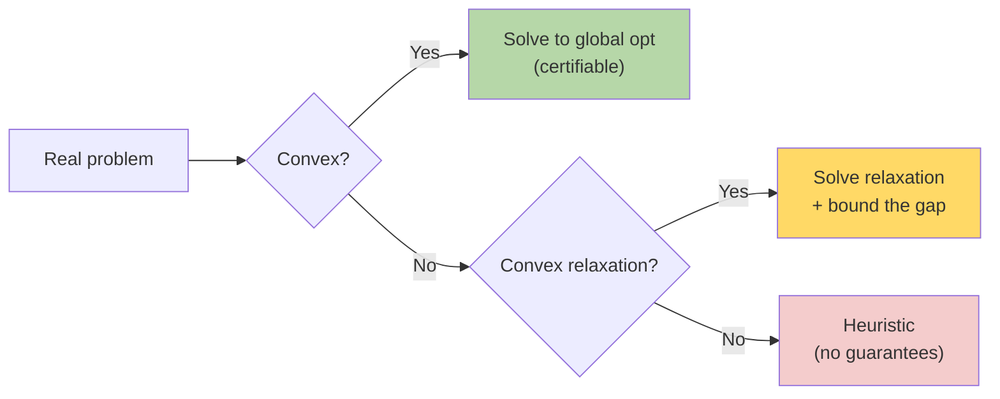

# Convex Optimization — Real-World Stories

> A convex problem has one minimum — and you can prove it. A non-convex one might hide a $10M better answer you'll never find.

## The Big Idea

If both the objective and the feasible region are convex, every local minimum is the global minimum. Spotting that structure (or finding a convex relaxation of a hard problem) is half the battle.



## Code: Convex QP for Portfolio Hedging

```python
import cvxpy as cp
import numpy as np

n = 5
prices = np.array([3.1, 3.0, 3.2, 2.95, 3.05])
Sigma  = np.array([[0.04, 0.01, 0.00, 0.00, 0.01],
                   [0.01, 0.05, 0.00, 0.01, 0.00],
                   [0.00, 0.00, 0.06, 0.00, 0.02],
                   [0.00, 0.01, 0.00, 0.03, 0.00],
                   [0.01, 0.00, 0.02, 0.00, 0.04]])
target_gallons = 1_000_000

x = cp.Variable(n, nonneg=True)
objective = cp.Minimize(cp.quad_form(x, cp.psd_wrap(Sigma)))
constraints = [cp.sum(x) == target_gallons, x @ prices <= 3.15 * target_gallons]
prob = cp.Problem(objective, constraints)
prob.solve()
print("optimal alloc:", x.value)
print("variance:    ", prob.value)
```

## Code: LP Relaxation of an Integer Problem

```python
import cvxpy as cp
import numpy as np

N, K = 20, 50
cost = np.random.rand(N, K)

x = cp.Variable((N, K))
prob = cp.Problem(
    cp.Minimize(cp.sum(cp.multiply(cost, x))),
    [x >= 0, x <= 1, cp.sum(x, axis=0) == 1]
)
prob.solve()
print("LP relaxation lower bound:", prob.value)
```

## Story 1: Amazon — Why Inventory Placement Can Say "We're Within 2% of Optimal"

Where to stock each SKU across ~175 fulfillment centers is technically an integer problem — you can't stock 1.4 units. But the *relaxation* (allow fractional units) is convex. Solve the relaxation, round to integers, and you can mathematically bound the gap.

Engineers do exactly this. The result isn't just a plan; it's a plan plus a guarantee: "this is within 2% of optimal." That's the language leadership wants. A heuristic alone gives a plan but no guarantee — and you can't tell if you're 2% off or 30%.

## Story 2: American Airlines — Why Fuel Hedging Is Solved in Milliseconds With a Proof

Treasury hedges jet fuel price risk by buying futures. The question is: how much of each instrument do you buy to minimize variance while still covering your needed gallons?

That problem is a convex quadratic program. Tools like `cvxpy` solve it in milliseconds and return an answer that's *provably* optimal. Grid-searching the same problem would be slow, wasteful, and uncertifiable — and treasury would have no math to defend the allocation in an audit.

## Remember This

- Look for convex structure first. Most "hard" problems have a useful convex relaxation.
- Convex solvers give you certificates of optimality, not just answers.
- For mixed-integer: relax → solve → round → *bound the gap*.
